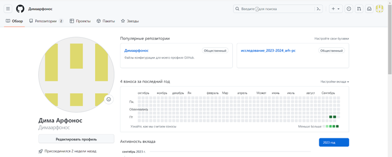
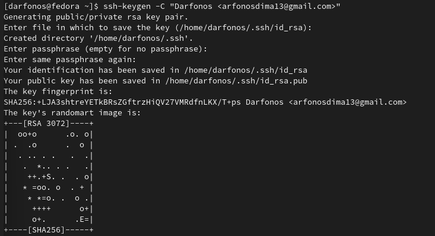
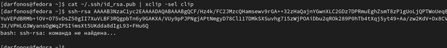
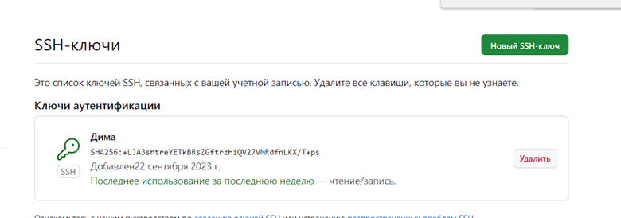
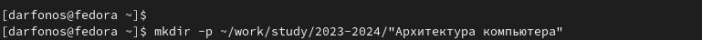
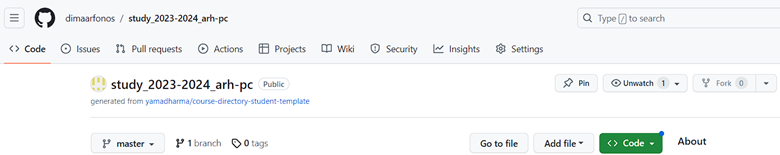
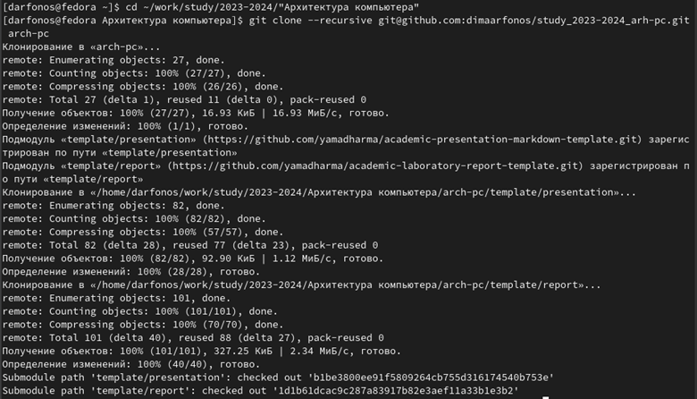
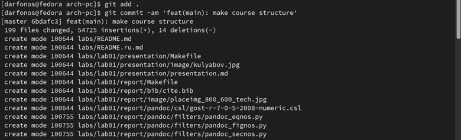
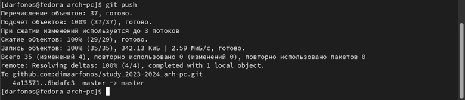
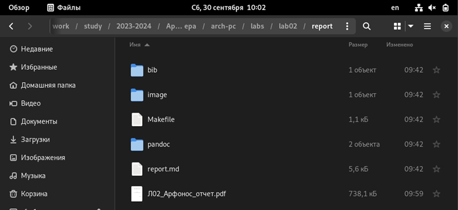

---
## Front matter
title: "Отчёт по лабораторной работе №2"
subtitle: "Простейший вариант"
author: "Арфонос Дмитрий

## Generic otions
lang: ru-RU
toc-title: "Содержание"

## Bibliography
bibliography: bib/cite.bib
csl: pandoc/csl/gost-r-7-0-5-2008-numeric.csl

## Pdf output format
toc: true # Table of contents
toc-depth: 2
lof: true # List of figures
lot: true # List of tables
fontsize: 12pt
linestretch: 1.5
papersize: a4
documentclass: scrreprt
## I18n polyglossia
polyglossia-lang:
  name: russian
  options:
	- spelling=modern
	- babelshorthands=true
polyglossia-otherlangs:
  name: english
## I18n babel
babel-lang: russian
babel-otherlangs: english
## Fonts
mainfont: PT Serif
romanfont: PT Serif
sansfont: PT Sans
monofont: PT Mono
mainfontoptions: Ligatures=TeX
romanfontoptions: Ligatures=TeX
sansfontoptions: Ligatures=TeX,Scale=MatchLowercase
monofontoptions: Scale=MatchLowercase,Scale=0.9
## Biblatex
biblatex: true
biblio-style: "gost-numeric"
biblatexoptions:
  - parentracker=true
  - backend=biber
  - hyperref=auto
  - language=auto
  - autolang=other*
  - citestyle=gost-numeric
## Pandoc-crossref LaTeX customization
figureTitle: "Рис."
tableTitle: "Таблица"
listingTitle: "Листинг"
lofTitle: "Список иллюстраций"
lotTitle: "Список таблиц"
lolTitle: "Листинги"
## Misc options
indent: true
header-includes:
  - \usepackage{indentfirst}
  - \usepackage{float} # keep figures where there are in the text
  - \floatplacement{figure}{H} # keep figures where there are in the text
---

# Цель работы

Ознакомиться с принципами работы средств контроля версий. Настроить git для начала работы. Используя git, создать рабочее пространство и репозиторий курса, после чего загрузить файлы на github.

# Выполнение лабораторной работы

### 1. Настройка github
 Создали учётную запись на сайте github 
 {#fig:001 width=700}
### 2
Указали имя и e-mail владельца репозитория
{#fig:001 width=700}
### 3
•	Настроили utf-8 в выводе сообщений git
•	Задали имя “мастер” для начальной ветки.
•	Настроили параметры autocrlf и safecrlf
{#fig:001 width=700}{#fig:001 width=700}
### 4
Сгенерировали пару ключей (приватный и открытый)
{#fig:001 width=700}
### 5
Создали  SSH-ключ на сайте github и дали ей “Дима”.
{#fig:001 width=700}
### 6
Создали каталог для предмета «Архитектура компьютера»
{#fig:001 width=700}
### 7
Создали репозиторий курса на основе шаблона через web-интерфейс github.
{#fig:001 width=700}
### 8
Перешли в каталог курса и клонировали созданный на сайте репозиторий в новый каталог arch-pc.
{#fig:001 width=700}
### 9 
Перешли  в новый каталог и удалили лишние файлы и создали необходимые каталоги.
{#fig:001 width=700}
### 10
Вводим нужные команды и отправляем файлы на сервер.
{#fig:001 width=700}
{#fig:001 width=700}

# Самостоятельная работа
### 1
Создаю отчет по выполнению лабораторной работы и вставляю соответствующий каталог  lab02.
{#fig:001 width=700}
### 2
Копирую предыдущий отчет по первой лабораторной работе в соответствующий ей каталог.
{#fig:001 width=700}
### 3
Загружаю файлы на github
{#fig:001 width=700}
{#fig:001 width=700}
# Вывод
В этой лабораторной работе я ознакомился с принципами работы средств контроля версий, настроил git для начала работы на линуксе. Используя git, создал рабочее пространство и репозиторий курса, после чего научился загружать файлы на github.
