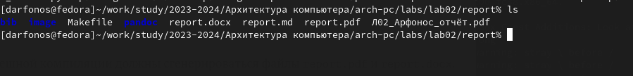

---
## Front matter
title: "Очёт по лабораторной работе"
subtitle: "Дисципл"
author: "Арфонос Д."

## Generic otions
lang: ru-RU
toc-title: "Содержание"

## Bibliography
bibliography: bib/cite.bib
csl: pandoc/csl/gost-r-7-0-5-2008-numeric.csl

## Pdf output format
toc: true # Table of contents
toc-depth: 2
lof: true # List of figures
lot: true # List of tables
fontsize: 12pt
linestretch: 1.5
papersize: a4
documentclass: scrreprt
## I18n polyglossia
polyglossia-lang:
  name: russian
  options:
	- spelling=modern
	- babelshorthands=true
polyglossia-otherlangs:
  name: english
## I18n babel
babel-lang: russian
babel-otherlangs: english
## Fonts
mainfont: PT Serif
romanfont: PT Serif
sansfont: PT Sans
monofont: PT Mono
mainfontoptions: Ligatures=TeX
romanfontoptions: Ligatures=TeX
sansfontoptions: Ligatures=TeX,Scale=MatchLowercase
monofontoptions: Scale=MatchLowercase,Scale=0.9
## Biblatex
biblatex: true
biblio-style: "gost-numeric"
biblatexoptions:
  - parentracker=true
  - backend=biber
  - hyperref=auto
  - language=auto
  - autolang=other*
  - citestyle=gost-numeric
## Pandoc-crossref LaTeX customization
figureTitle: "Рис."
tableTitle: "Таблица"
listingTitle: "Листинг"
lofTitle: "Список иллюстраций"
lotTitle: "Список таблиц"
lolTitle: "Листинги"
## Misc options
indent: true
header-includes:
  - \usepackage{indentfirst}
  - \usepackage{float} # keep figures where there are in the text
  - \floatplacement{figure}{H} # keep figures where there are in the text
---

# Цель работы

Целью работы является освоение работы с Markdown и оформление отчетов с помощью легкового языка разметки Markdown.

# Выполнение лабораторной работы

Открываю терминал и перехожу в рабочий каталог arch-pc. Обновляю репозиторий с помощью команды git pull.

{#fig:001 width=70%}

### 2

Перехожу в каталог с шаблоном отчета по лабораторной работе №3 и выполняю компиляцию.

 {#fig:001 width=70%}

### 3

Проверяю выполнилась ли компиляция.

{#fig:001 width=70%}

### 4

Выполняю удаление новых компилированных файлов.

{#fig:001 width=70%}

### 5

Проверяем удаление файлов.

{#fig:001 width=70%}

### 6

Открываю файл report.md с помощью текстового редактора и делаю отчет по лабораторной работе.

{#fig:001 width=70%}

# Самостоятельная работа

### 1

Перехожу в каталог 2-ой лабораторной работы.

{#fig:001 width=70%}

### 2

Переименовываю файл и компилирую в pdf и docs формат.

{#fig:001 width=70%}

### 3

Проверяю выполнение.

{#fig:001 width=70%}

### 4

Загружаю файлы на gitgub.

{#fig:001 width=70%}

# Вывод

В ходе выполнения этой лабораторной работы я освоил процедуру оформления  отчетов с помощью языка разметки Markdown. 

::: {#refs}
:::
