---
## Front matter
title: "Отчет по лабораторной работе №4"
subtitle: "Дисциплина: архитектура компьютера"
author: "Арфонос Дмитрий"

## Generic otions
lang: ru-RU
toc-title: "Содержание"

## Bibliography
bibliography: bib/cite.bib
csl: pandoc/csl/gost-r-7-0-5-2008-numeric.csl

## Pdf output format
toc: true # Table of contents
toc-depth: 2
lof: true # List of figures
lot: true # List of tables
fontsize: 12pt
linestretch: 1.5
papersize: a4
documentclass: scrreprt
## I18n polyglossia
polyglossia-lang:
  name: russian
  options:
	- spelling=modern
	- babelshorthands=true
polyglossia-otherlangs:
  name: english
## I18n babel
babel-lang: russian
babel-otherlangs: english
## Fonts
mainfont: PT Serif
romanfont: PT Serif
sansfont: PT Sans
monofont: PT Mono
mainfontoptions: Ligatures=TeX
romanfontoptions: Ligatures=TeX
sansfontoptions: Ligatures=TeX,Scale=MatchLowercase
monofontoptions: Scale=MatchLowercase,Scale=0.9
## Biblatex
biblatex: true
biblio-style: "gost-numeric"
biblatexoptions:
  - parentracker=true
  - backend=biber
  - hyperref=auto
  - language=auto
  - autolang=other*
  - citestyle=gost-numeric
## Pandoc-crossref LaTeX customization
figureTitle: "Рис."
tableTitle: "Таблица"
listingTitle: "Листинг"
lofTitle: "Список иллюстраций"
lotTitle: "Список таблиц"
lolTitle: "Листинги"
## Misc options
indent: true
header-includes:
  - \usepackage{indentfirst}
  - \usepackage{float} # keep figures where there are in the text
  - \floatplacement{figure}{H} # keep figures where there are in the text
---

# Цель работы

Цель данной лабораторной работы - освоение процедуры компиляции и сборки программ, написанных на ассемблере NASM.

# Выполнение лабораторной работы

**шаг 1**

Создаю католог arch-pc/lab05 и перехожу в неё. (рис. [-@fig:001]).

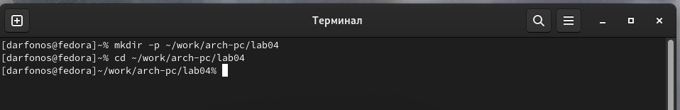{ #fig:001 width=70% }

**шаг 2**

Открываю файл hello.asm с помощью текстового редактора и набираю программу (рис. [-@fig:002]).

{ #fig:002 width=70% }

**шаг 3**

Компилирую файл программы в объктный файл. Проверяю, объектный файл был создан. (рис. [-@fig:003]).

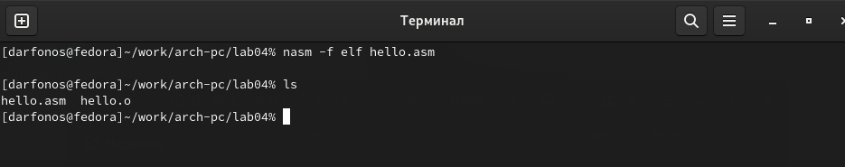{ #fig:003 width=70% }

**шаг 4**

Выполняю компиляцию файла с помощью расширенного синтаксиса командной строоки  NASM, и проверяю выполнениие (рис. [-@fig:004]).

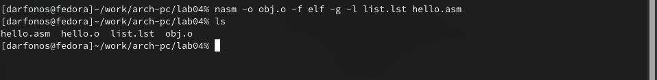{ #fig:004 width=70% }

**шаг 5**

Передаю файл на обработку компоновщику LD и проверяю выполнение. (рис. [-@fig:005]).

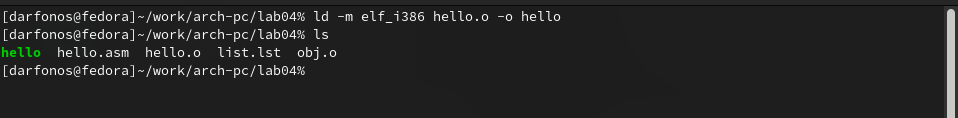{ #fig:005 width=70% }

**шаг 6**

Выполняю команду, создаю исполняемый файл main (рис. [-@fig:006]).

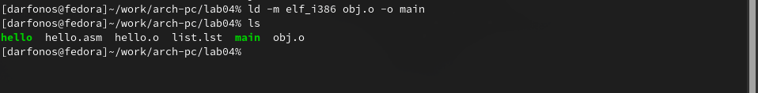{ #fig:006 width=70% }

#### Исполняемый файл будет иметь имя main, объектный файл иммет имя obj.o.

**шаг 7**

Запускаю исполняемый файл (рис. [-@fig:007]).

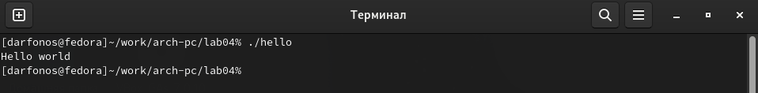{ #fig:007 width=70% }

# Выполнение заданий для самостоятельной работы

**1)**

Копирую файл hello.asm с именем lab04.asm и проверяю выполнение. (рис. [-@fig:008]).

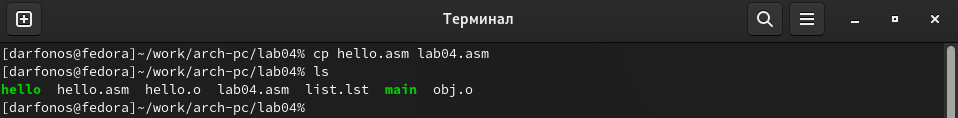{ #fig:008 width=70% }

**2)**

Открываю файл и изменяю программу так, чтобы она вывела имя и фамилию (рис. [-@fig:009]).

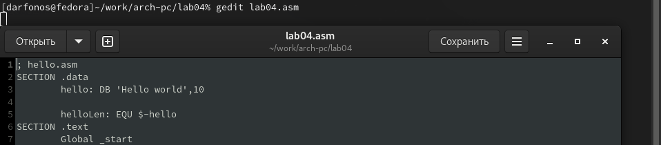{ #fig:009 width=70% }

**3)**

Транслирую текст программы в объектный файл, выполняю компоновку объектного файла и запускаю получившийся исполняемый файл (рис. [-@fig:010]).

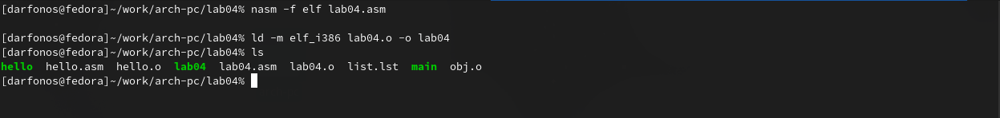{ #fig:010 width=70% }

**4)**

Запускаю получившийся исполняемый файл (рис. [-@fig:011]).

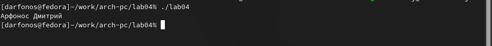{ #fig:011 width=70% }

**5)**

Копирую файлы hello.asm и lab04.asm в мой локальный репозиторий в lab04. (рис. [-@fig:012]).

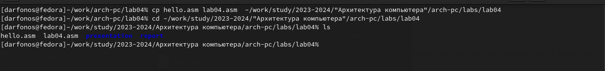{ #fig:011 width=70% }

**6)**

Загружаю файла на GitHub (рис. [-@fig:013]).

{ #fig:012 width=70% }

# Выводы

Я освоил процедуры компиляции и сборки программ, написанных на ассемблере NASM.
