---
## Front matter
title: "Отчёт по лабораторной работе №5"
subtitle: "Дисциплина: архитектура компьютера"
author: "Арфонос Дмитрий"

## Generic otions
lang: ru-RU
toc-title: "Содержание"

## Bibliography
bibliography: bib/cite.bib
csl: pandoc/csl/gost-r-7-0-5-2008-numeric.csl

## Pdf output format
toc: true # Table of contents
toc-depth: 2
lof: true # List of figures
lot: true # List of tables
fontsize: 12pt
linestretch: 1.5
papersize: a4
documentclass: scrreprt
## I18n polyglossia
polyglossia-lang:
  name: russian
  options:
	- spelling=modern
	- babelshorthands=true
polyglossia-otherlangs:
  name: english
## I18n babel
babel-lang: russian
babel-otherlangs: english
## Fonts
mainfont: PT Serif
romanfont: PT Serif
sansfont: PT Sans
monofont: PT Mono
mainfontoptions: Ligatures=TeX
romanfontoptions: Ligatures=TeX
sansfontoptions: Ligatures=TeX,Scale=MatchLowercase
monofontoptions: Scale=MatchLowercase,Scale=0.9
## Biblatex
biblatex: true
biblio-style: "gost-numeric"
biblatexoptions:
  - parentracker=true
  - backend=biber
  - hyperref=auto
  - language=auto
  - autolang=other*
  - citestyle=gost-numeric
## Pandoc-crossref LaTeX customization
figureTitle: "Рис."
tableTitle: "Таблица"
listingTitle: "Листинг"
lofTitle: "Список иллюстраций"
lotTitle: "Список таблиц"
lolTitle: "Листинги"
## Misc options
indent: true
header-includes:
  - \usepackage{indentfirst}
  - \usepackage{float} # keep figures where there are in the text
  - \floatplacement{figure}{H} # keep figures where there are in the text
---

# Цель работы

Цель данной лабораторной работы - приобретение практических навыков работы в Midnight Commander и освоение инструкций языка ассемблера mov и int

# Выполнение лабораторной работы

**Шаг 1**

Открываю Midnight Commander, перехожу в каталог arch-pc и создаю рабочий каталог lab05 (рис. [-@fig:001]).

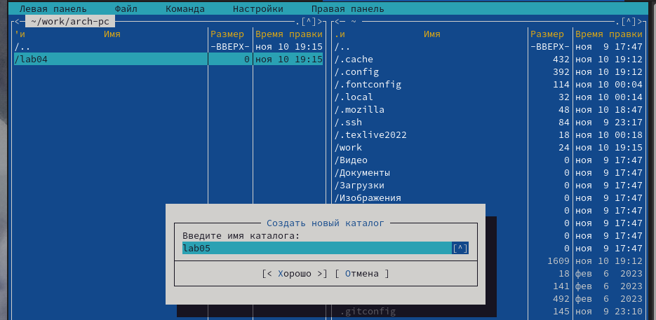{ #fig:001 width=70% }

**Шаг 2**

Перехожу в созданную директорию и создаю файл lab5-1.asm (рис. [-@fig:002]).

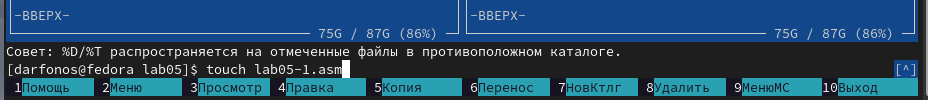{ #fig:002 width=70% }

**Шаг 3**

Открываю файл lab5-1.asm для редактирования во встроенном редакторе nano и вставляю в него программу (рис. [-@fig:003]).

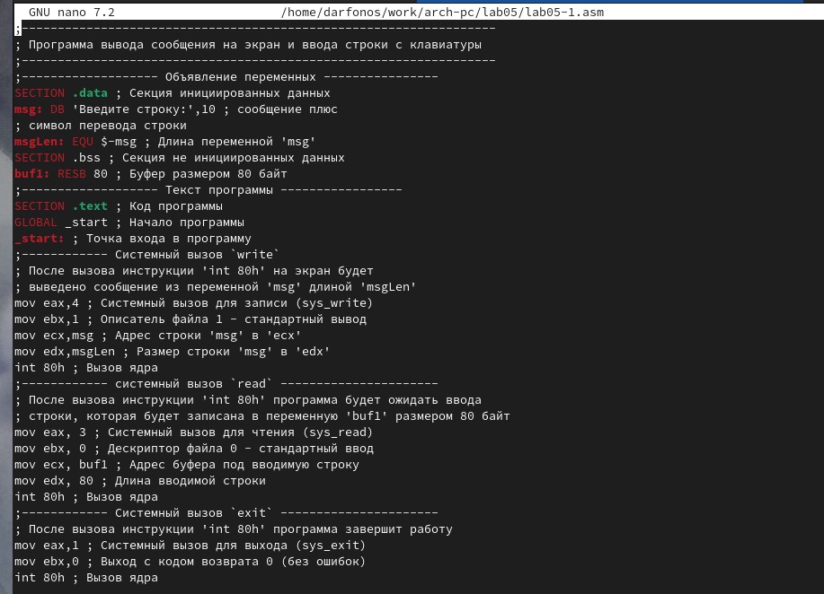{ #fig:003 width=70% }

**Шаг 4**

Открываю файл lab5-1.asm для просмотра (рис. [-@fig:004]).

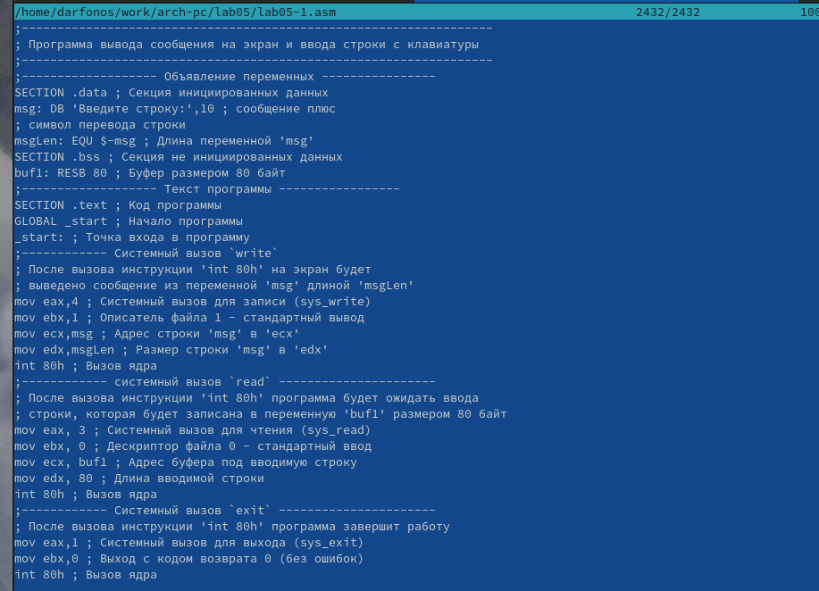{ #fig:004 width=70% }

**Шаг 5**

Создаю объектный файл lab5-1.o, выполняю компоновку объектного файла и запускаю исполняемый файл (рис. [-@fig:005]).

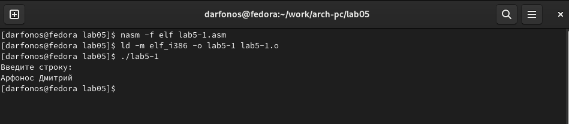{ #fig:005 width=70% }

**Шаг 6**

Скачиваю файл in_out.asm, копирую его из директории Загрузки в директорию lab05 (рис. [-@fig:006]).

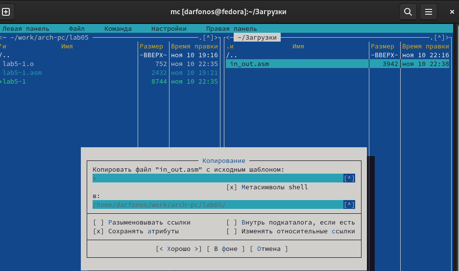{ #fig:006 width=70% }

**Шаг 7**

Копирую файл lab5-1.asm с новым именем lab5-2.asm (рис. [-@fig:007]).

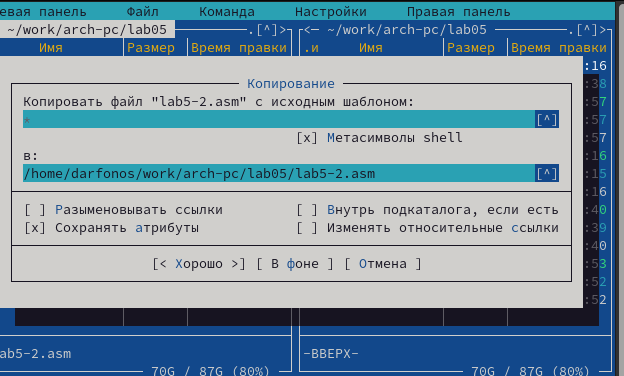{ #fig:007 width=70% }

**Шаг 8**

Изменяю текст программы lab5-2.asm, чтобы в ней использовались функции из подключаемого файла (рис. [-@fig:008]).

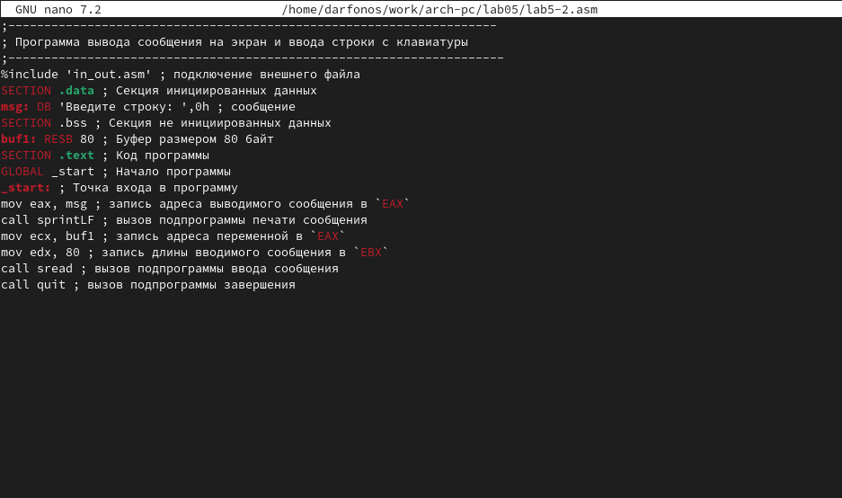{ #fig:008 width=70% }

**Шаг 9**

Создаю объектный файл lab5-2.o, выполняю компоновку объектного файла и запускаю исполняемый файл (рис. [-@fig:009]).

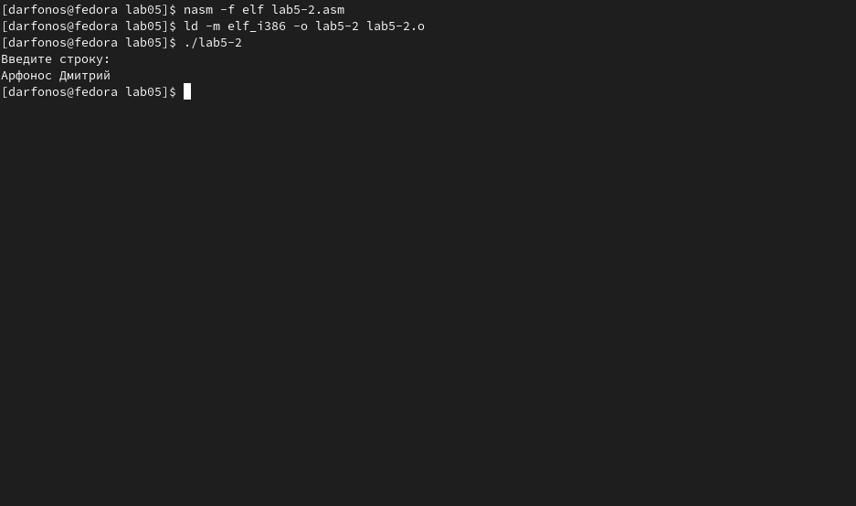{ #fig:009 width=70% }

**Шаг 10**

В тексте программы lab5-2.asm заменяю *sprintLF* на *sprint* (рис. [-@fig:010]).

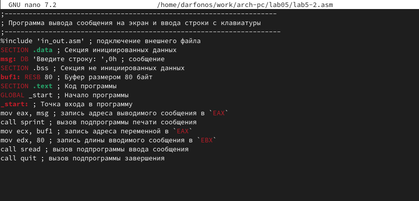{ #fig:010 width=70% }

**Шаг 11**

Создаю объектный файл *lab5-2.o*, выполняю компоновку объектного файла и запускаю исполняемый файл (рис. [-@fig:011]).

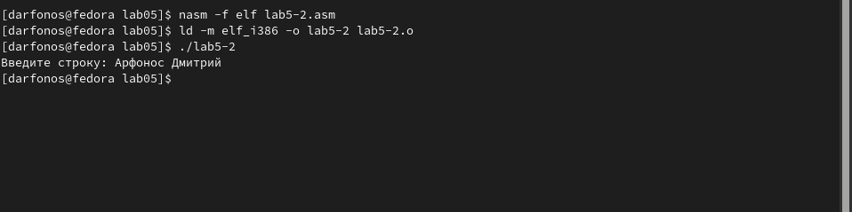{ #fig:011 width=70% }

- **Теперь ввод производится на той же строке, что и вывод, убран символ перевода строки после вывода.**

# Выполнение заданий для самостоятельной работы

## Задание №1

**1.**  Копирую файл lab5-1.asm с именем lab5-3.asm (рис. [-@fig:012]).

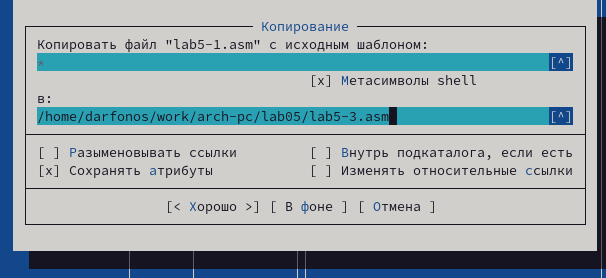{ #fig:012 width=70% }

**2.** Изменяю код программы, добавляя вывод введенной строки (рис. [-@fig:013]).

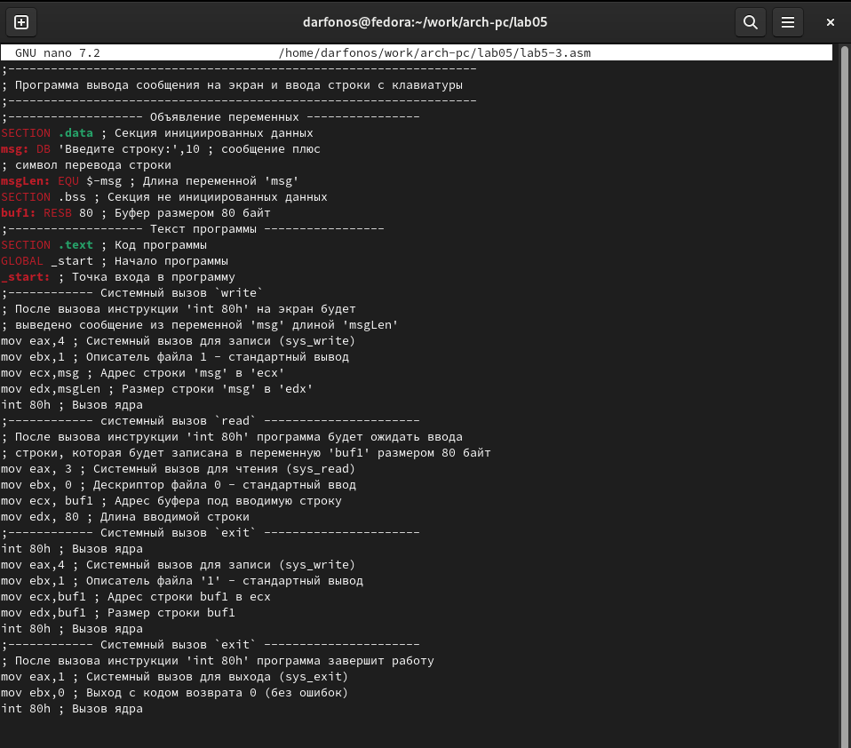{ #fig:013 width=70% }

* **Текст программы из фотоотчёта** (рис. [-@fig:013]).

```NASM
;------------------- Объявление переменных ----------------
SECTION .data ; Секция инициированных данных
msg: DB 'Введите строку:',10 ; сообщение плюс
; символ перевода строки
msgLen: EQU $-msg ; Длина переменной 'msg'
SECTION .bss ; Секция не инициированных данных
buf1: RESB 80 ; Буфер размером 80 байт
;------------------- Текст программы -----------------
SECTION .text ; Код программы
GLOBAL _start ; Начало программы
_start: ; Точка входа в программу
mov eax,4 ; Системный вызов для записи (sys_write)
mov ebx,1 ; Описатель файла 1 - стандартный вывод
mov ecx,msg ; Адрес строки 'msg' в 'ecx'
mov edx,msgLen ; Размер строки 'msg' в 'edx'
int 80h ; Вызов ядра
mov eax, 3 ; Системный вызов для чтения (sys_read)
mov ebx, 0 ; Дескриптор файла 0 - стандартный ввод
mov ecx, buf1 ; Адрес буфера под вводимую строку
mov edx, 80 ; Длина вводимой строки
;-------вывод на экран---------
int 80h ; Вызов ядра
mov eax,4 ; Системный вызов для записи (sys_write)
mov ebx,1 ; Описатель файла '1' - стандартный вывод
mov ecx,buf1 ; Адрес строки buf1 в ecx
mov edx,buf1 ; Размер строки buf1
;------------------------------
int 80h ; Вызов ядра
mov eax,1 ; Системный вызов для выхода (sys_exit)
mov ebx,0 ; Выход с кодом возврата 0 (без ошибок)
int 80h ; Вызов ядра
```

**3.** Создаю объектный файл lab5-3.o, компоную его в исполняемый файл, запускаю исполняемый файл (рис. [-@fig:014]).

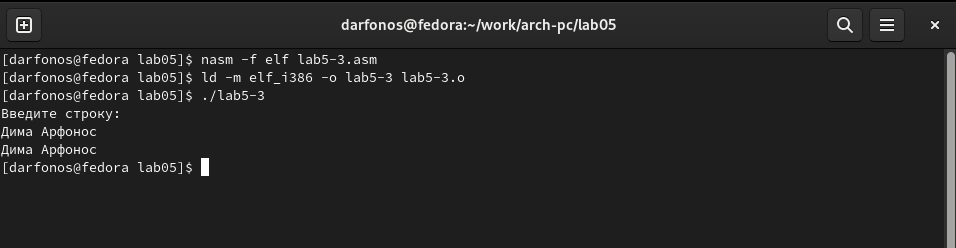{ #fig:014 width=70% }


## Задание №2

**1.** Копирую файл lab5-2.asm с именем lab5-4.asm (рис. [-@fig:015]).

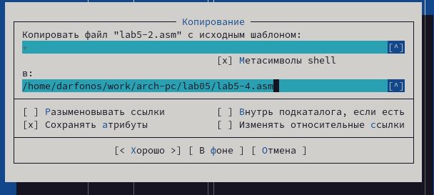{ #fig:015 width=70% }

**2.** Изменяю код программы, добавляя вывод введенной строки (рис. [-@fig:016]).

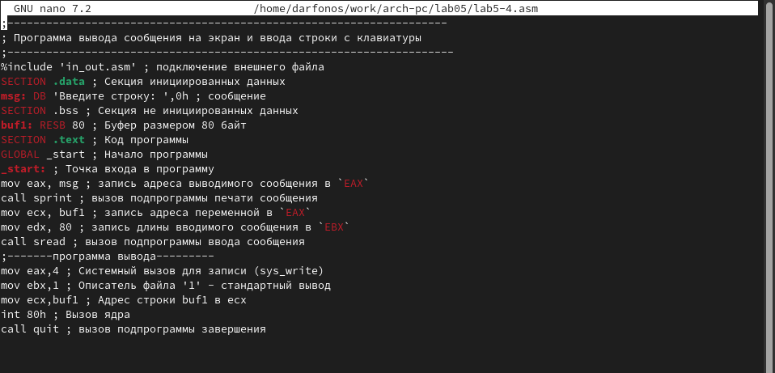{ #fig:016 width=70% }

* **Текст программы из фотоотчёта** (рис. [-@fig:016])

```NASM
;--------------------------------------------------------------------
; Программа вывода сообщения на экран и ввода строки с клавиатуры
;---------------------------------------------------------------------
%include 'in_out.asm' ; подключение внешнего файла
SECTION .data ; Секция инициированных данных
msg: DB 'Введите строку: ',0h ; сообщение
SECTION .bss ; Секция не инициированных данных
buf1: RESB 80 ; Буфер размером 80 байт
SECTION .text ; Код программы
GLOBAL _start ; Начало программы
_start: ; Точка входа в программу
mov eax, msg ; запись адреса выводимого сообщения в `EAX`
call sprint ; вызов подпрограммы печати сообщения
;--------------вывод на экран-----------
mov ecx, buf1 ; запись адреса переменной в `EAX`
mov edx, 80 ; запись длины вводимого сообщения в `EBX`
call sread ; вызов подпрограммы ввода сообщения
mov eax,4 ; Системный вызов для записи (sys_write)
mov ebx,1 ; Описатель файла '1' - стандартный вывод
mov ecx,buf1 ; Адрес строки buf1 в ecx
int 80h ; Вызов ядра
call quit ; вызов подпрограммы завершения
```

**3.** Создаю объектный файл lab5-4.o, компоную его в исполняемый файл, запускаю исполняемый файл (рис. [-@fig:017]).

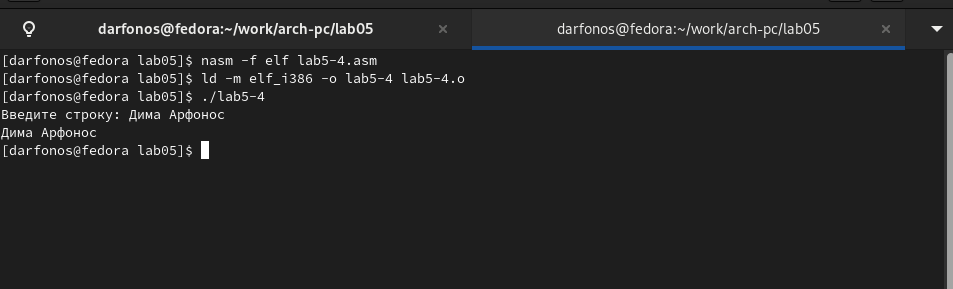{ #fig:017 width=70% }

# Вывод

Я приобрел практические навыки работы в Midnight Commander и освоил
инструкции  mov и int в языке ассемблер.
