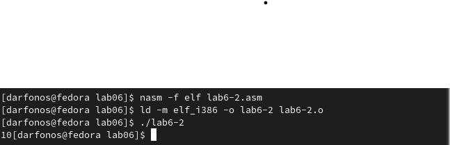
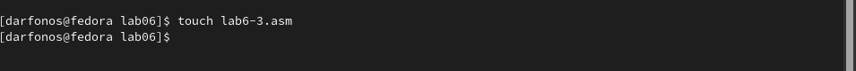
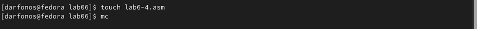

---
## Front matter
title: "Отчёт по лабораторной работе №6"
subtitle: "Дисциплина: архитектура компьютера"
author: "Арфонос Дмитрий"

## Generic otions
lang: ru-RU
toc-title: "Содержание"

## Bibliography
bibliography: bib/cite.bib
csl: pandoc/csl/gost-r-7-0-5-2008-numeric.csl

## Pdf output format
toc: true # Table of contents
toc-depth: 2
lof: true # List of figures
fontsize: 12pt
linestretch: 1.5
papersize: a4
documentclass: scrreprt
## I18n polyglossia
polyglossia-lang:
  name: russian
  options:
	- spelling=modern
	- babelshorthands=true
polyglossia-otherlangs:
  name: english
## I18n babel
babel-lang: russian
babel-otherlangs: english
## Fonts
mainfont: PT Serif
romanfont: PT Serif
sansfont: PT Sans
monofont: PT Mono
mainfontoptions: Ligatures=TeX
romanfontoptions: Ligatures=TeX
sansfontoptions: Ligatures=TeX,Scale=MatchLowercase
monofontoptions: Scale=MatchLowercase,Scale=0.9
## Biblatex
biblatex: true
biblio-style: "gost-numeric"
biblatexoptions:
  - parentracker=true
  - backend=biber
  - hyperref=auto
  - language=auto
  - autolang=other*
  - citestyle=gost-numeric
## Pandoc-crossref LaTeX customization
figureTitle: "Рис."
listingTitle: "Листинг"
lofTitle: "Список иллюстраций"
lolTitle: "Листинги"
## Misc options
indent: true
header-includes:
  - \usepackage{indentfirst}
  - \usepackage{float} # keep figures where there are in the text
  - \floatplacement{figure}{H} # keep figures where there are in the text
---

# Цель работы

Цель данной лабораторной работы - освоение арифметческих инструкций низкоуровневого языка ассемблера NASM.

***

# Задание

1. Символьные и численные данные в NASM
2. Выполнение арифметических операций в NASM
3. Выполнение заданий для самостоятельной работы

***
# Выполнение лабораторной работы

## Символьные и численные данные в NASM

**1**

С помощью утилиты mkdir создаю директорию lab06, перехожу в нее и создаю файл для работы. (рис. [-@fig:001])

{ #fig:001 width=70% }

**2**

Копирую в текущий каталог файл in_out.asm из загрузок с помощью утилиты cp, т.к. он будет использоваться в других программах (рис. [-@fig:002]).

{ #fig:002 width=70% }

**3**

Открываю созданный файл lab6-1.asm, вставляю в него программу вывода значения регистра eax (рис. [-@fig:003]).

{ #fig:003 width=70% }

**4**

Создаю исполняемый файл программы и запускаю его (рис. [-@fig:004]). Вывод программы: символ j, потому что программа вывела символ, соответствующий по системе ASCII сумме двоичных кодов символов 4 и 6.

{ #fig:004 width=70% }

**5**

Изменяю в тексте программы символы "6" и "4" на цифры 6 и 4 (рис. [-@fig:005]). 

{ #fig:005 width=70% }

**6**

Создаю новый исполняемый файл программы и запускаю его (рис. [-@fig:006]). Теперь вывелся символ с кодом 10, это символ перевода строки, этот символ не отображается при выводе на экран.

{ #fig:006 width=70% }

**7**

Создаю новый файл lab6-2.asm с помощью утилиты touch (рис. [-@fig:007]).

{ #fig:007 width=70% }

**8**

Ввожу в файл текст другой программы для вывода значения регистра eax (рис. [-@fig:008]).

{ #fig:008 width=70% }

**9** 

Создаю и запускаю исполняемый файл lab6-2 (рис. [-@fig:009]). Теперь вывод число 106, потому что программа позволяет вывести именно число, а не символ, хотя все еще происходит именно сложение кодов символов "6" и "4".

{ #fig:009 width=70% }

**10**

Заменяю в тексте программы в файле lab6-2.asm символы "6" и "4" на числа 6 и 4 (рис. [-@fig:010]).

{ #fig:010 width=70% }

**11**

Создаю и запускаю новый исполняемый файл (рис. [-@fig:011]).. Теперь программа складывает не соответствующие символам коды в системе ASCII, а сами числа, поэтому вывод 10.

{ #fig:011 width=70% }

**12**

Заменяю в тексте программы функцию iprintLF на iprint (рис. [-@fig:012]).

{ #fig:012 width=70% }

**13**

Создаю и запускаю новый исполняемый файл (рис. [-@fig:013]). Вывод не изменился, потому что символ переноса строки не отображался, когда программа исполнялась с функцией iprintLF, а iprint не добавляет к выводу символ переноса строки, в отличие от iprintLF.

{ #fig:013 width=70% }

## Выполнение арифметических операций в NASM

**14**

Создаю файл lab6-3.asm с помощью утилиты touch (рис. [-@fig:014]).

{ #fig:014 width=70% }

**15**

Ввожу в созданный файл текст программы для вычисления значения выражения f(x) = (5 * 2 + 3)/3 (рис. [-@fig:015]).

{ #fig:016 width=70% }

**16**

Создаю исполняемый файл и запускаю его (рис. [-@fig:016]).

{ #fig:016 width=70% }

**17**

Изменяю программу так, чтобы она вычисляла значение выражения f(x) = (4 * 6 + 2)/5 (рис. [-@fig:017]). 

{ #fig:017 width=70% }

**18**

Создаю и запускаю новый исполняемый файл (рис. [-@fig:018]). Программа отработала верно.

{ #fig:018 width=70% }

**19**

Создаю файл variant.asm с помощью  утилиты touch (рис. [-@fig:019]).

{ #fig:019 width=70% }

**20**

Ввожу в файл текст программы для вычисления варианта задания по номеру студенческого билета (рис. [-@fig:020]).

{ #fig:020 width=70% }

**21**

Создаю и запускаю исполняемый файл (рис. [-@fig:021]). Ввожу номер своего студ. билета "1032235421" с клавиатуры, программа вывела, что мой вариант - 2.

{ #fig:021 width=70% }

***
### Ответы на вопросы по программе

1. За вывод сообщения "Ваш вариант" отвечают строки кода:

```NASM
mov eax,rem
call sprint
```
2. Инструкция mov ecx, x используется, чтобы положить адрес вводимой строки x в регистр ecx
mov edx, 80 - запись в регистр edx длины вводимой строки 
call sread - вызов подпрограммы из внешнего файла, обеспечивающей ввод сообщения с клавиатуры  

3. call atoi используется для вызова подпрограммы из внешнего файла, которая преобразует ascii-код символа в целое число и записывает результат в регистр eax

4. За вычисления варианта отвечают строки:

```NASM
xor edx,edx ; обнуление edx для корректной работы div
mov ebx,20 ; ebx = 20
div ebx ; eax = eax/20, edx - остаток от деления
inc edx ; edx = edx + 1
```

5. При выполнении инструкции div ebx остаток от деления записывается в регистр edx

6. Инструкция inc edx увеличивает значение регистра edx на 1

7. За вывод на экран результатов вычислений отвечают строки:

```NASM
mov eax,edx
call iprintLF
```
***

## Выполнение заданий для самостоятельной работы

**Шаг 1**

Создаю файл lab6-4.asm с помощью утилиты touch (рис. [-@fig:022]).

{ #fig:022 width=70% }

**Шаг 2**

Открываю созданный файл для редактирования, ввожу в него текст программы для вычисления значения выражения 2 варианта: (рис. [-@fig:023]).  <u>*f(x) = (3+12x)5*</u>

{ #fig:023 width=70% }

**Шаг 3**

1. Создаю и запускаю исполняемый файл  при вводе двух значений (рис. [-@fig:024]).

 - x = 1, f(x) = 75
 - x = 6,  f(x) = 375
 
 Программа отработала верно.

{ #fig:024 width=70% }

**Текст программы из (рис. [-@fig:023]) для вычисления значения выражения f(x)=(3+12x)5**

```NASM
%include 'in_out.asm' ; подключение внешнего файла
SECTION .data ; секция инициированных данных
msg: DB 'Введите значение переменной х: ',0
rem: DB 'Результат: ',0
SECTION .bss ; секция не инициированных данных
x: RESB 80 ; Переменная, значение к-рой будем вводить с клавиатуры
SECTION .text ; Код программы
GLOBAL _start ; Начало программы
_start: ; Точка входа в программу
; ---- Вычисление выражения
mov eax, msg ; запись адреса выводимиого сообщения в eax
call sprint ; вызов подпрограммы печати сообщения
mov ecx, x ; запись адреса переменной в ecx
mov edx, 80 ; запись длины вводимого значения в edx
call sread ; вызов подпрограммы ввода сообщения
mov eax,x ; вызов подпрограммы преобразования
;------функция------
call atoi ; ASCII кода в число, `eax=x`
mov ebx,12 ; запись значения 2 в регистр ebx
mul ebx; EAX=EAX*EBX = (x*12)
add eax,3 ; eax = eax+3 = (3+12x)
mov ebx,5 ; ebx =5
mul ebx ; EAX=EAX*EBX = (3+12x)*5
mov edi,eax ; запись результата вычисления в 'edi'
; ---- Вывод результата на экран
mov eax,rem ; вызов подпрограммы печати
call sprint ; сообщения 'Результат: '
mov eax,edi ; вызов подпрограммы печати значения
call iprintLF ; из 'edi' в виде символов
call quit ; вызов подпрограммы завершения
```

# Выводы

При выполнении данной лабораторной работы я освоил арифметические инструкции: сложение, вычитание, умножение и деление на языке ассемблер NASM.
