---
## Front matter
title: "Отчёт по лабораторной работе №7"
subtitle: "Дисциплина: архитектура компьютера"
author: "Арфонос Дмитрий"

## Generic otions
lang: ru-RU
toc-title: "Содержание"

## Bibliography
bibliography: bib/cite.bib
csl: pandoc/csl/gost-r-7-0-5-2008-numeric.csl

## Pdf output format
toc: true # Table of contents
toc-depth: 2
lof: true # List of figures
fontsize: 12pt
linestretch: 1.5
papersize: a4
documentclass: scrreprt
## I18n polyglossia
polyglossia-lang:
  name: russian
  options:
	- spelling=modern
	- babelshorthands=true
polyglossia-otherlangs:
  name: english
## I18n babel
babel-lang: russian
babel-otherlangs: english
## Fonts
mainfont: PT Serif
romanfont: PT Serif
sansfont: PT Sans
monofont: PT Mono
mainfontoptions: Ligatures=TeX
romanfontoptions: Ligatures=TeX
sansfontoptions: Ligatures=TeX,Scale=MatchLowercase
monofontoptions: Scale=MatchLowercase,Scale=0.9
## Biblatex
biblatex: true
biblio-style: "gost-numeric"
biblatexoptions:
  - parentracker=true
  - backend=biber
  - hyperref=auto
  - language=auto
  - autolang=other*
  - citestyle=gost-numeric
## Pandoc-crossref LaTeX customization
figureTitle: "Рис."
listingTitle: "Листинг"
lofTitle: "Список иллюстраций"
lolTitle: "Листинги"
## Misc options
indent: true
header-includes:
  - \usepackage{indentfirst}
  - \usepackage{float} # keep figures where there are in the text
  - \floatplacement{figure}{H} # keep figures where there are in the text
---

# Цель работы

Изучение команд условного и безусловного переходов. Приобретение навыков написания
программ с использованием переходов. Знакомство с назначением и структурой файла
листинга

***

# Выполнение лабораторной работы

**1**

С помощью утилиты mkdir создаю директорию lab07, перехожу в нее и создаю файл для работы. (рис. [-@fig:001])

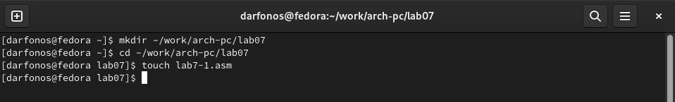{ #fig:001 width=70% }

**2**

Копирую в текущий каталог файл in_out.asm из загрузок, т.к. он будет использоваться в других программах (рис. [-@fig:002]).

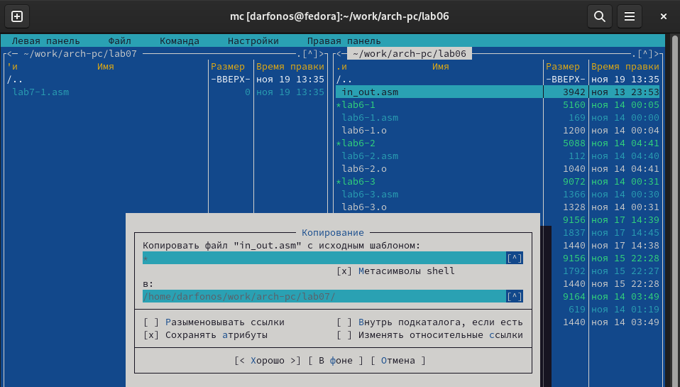{ #fig:002 width=70% }

**3**

Открываю созданный файл lab7-1.asm, вставляю в него программу реализации безусловных переходов(рис. [-@fig:003]).                                               

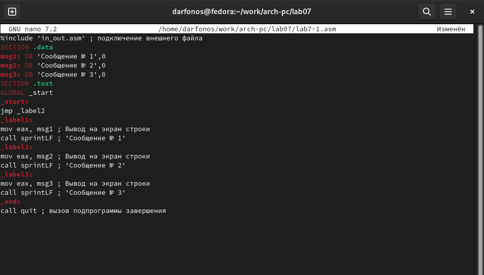{ #fig:003 width=70% }

**4**

Создаю исполняемый файл программы и запускаю его (рис. [-@fig:004]). Инструкции jmp _label2 меняет порядок исполнения инструкций и позволяет выполнить инструкции начиная с метки _label2.  

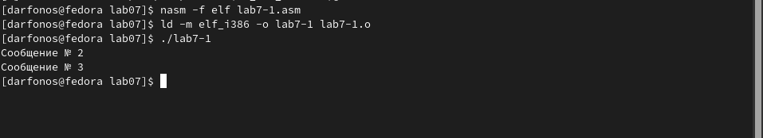{ #fig:004 width=70% }

**5**

Изменяю текст программы так, чтобы она выводила сначала ‘Сообщение № 2’, потом ‘Сообщение
№ 1’ и завершала работу  (рис. [-@fig:005]). 

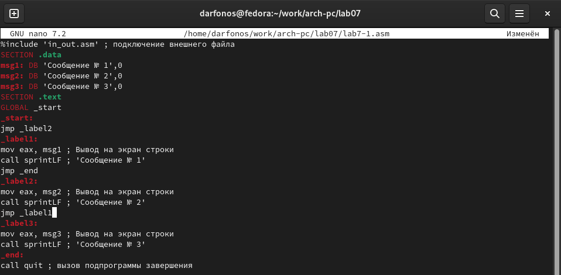{ #fig:005 width=70% }

**6**

Создаю новый исполняемый файл программы и запускаю его (рис. [-@fig:006]). Убеждаюсь в том, программа раотает верно.

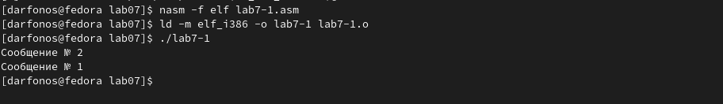{ #fig:006 width=70% }

**7**

Изменяю текст программы, так чтобы вывод происходил в обратном порядке (рис. [-@fig:007]).

{ #fig:007 width=70% }

**8**

 Создаю исполняемый файл и проверяю работу программы (рис. [-@fig:008]). Программа отработало верно.

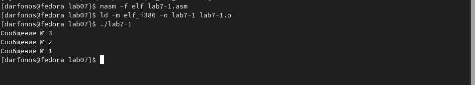{ #fig:008 width=70% }

**9** 

Создаю новый файл lab7-2.asm для программы с условным оператором. (рис. [-@fig:009]).

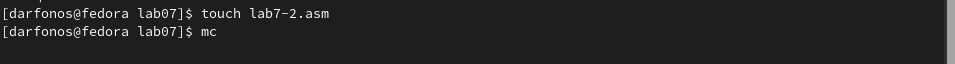{ #fig:009 width=70% }

**10**

Вставляю программу, которая определяет и выводит на экран наибольшее число (рис.[-@fig:010]).

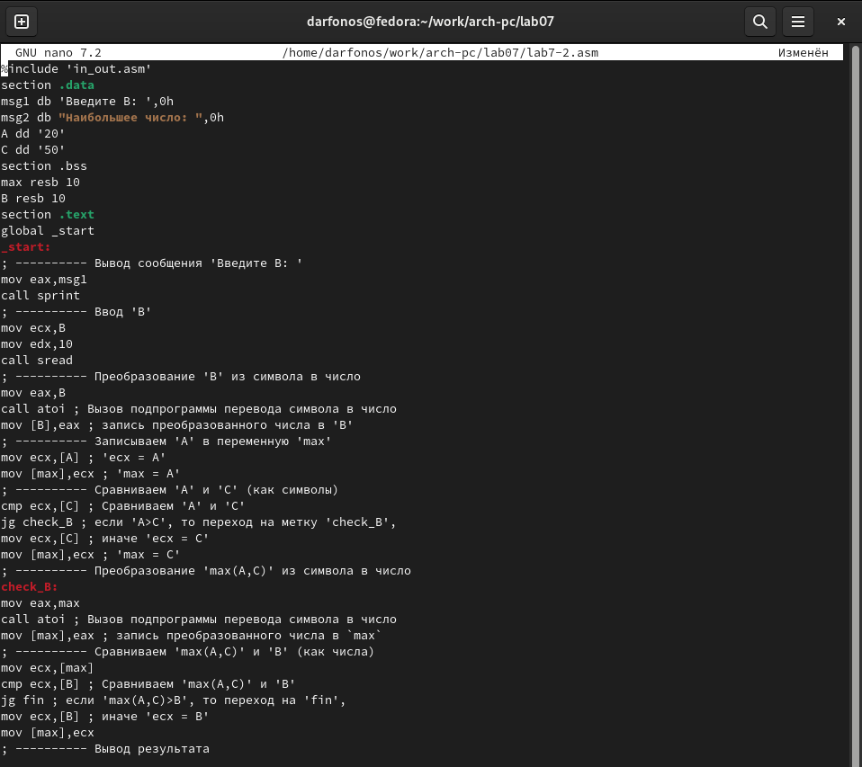{ #fig:010 width=70% }

**11**

Создаю и запускаю новый исполняемый файл, проверяю работу программы для разных B=40 и B=60, при А=20 и С=50 (рис. [-@fig:011]). 

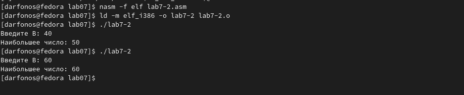{ #fig:011 width=70% }

**12**
Создаю файл листинга для программы в файле lab7-2.asm (рис. [-@fig:012]).

{ #fig:012 width=70% }

**13**

Открываю файл листинга с помощью редактора mcedit. Расмотрим 8-10 строки:
 - Перые цифры - это номер строки файла листинга.
 - • адрес — это смещение машинного кода от начала текущего сегмента, состоит из 8 чисел.
- следующие числа - это машинный код, который представляет собой ассемблированную исходную строку в виде шестнадцатеричной последовательности, поэтоу и появляются буквы латынского алфавита.
- следющее идет - исходный текст программы, которая просто состоит из строкк исходной программы вместе с комментариями

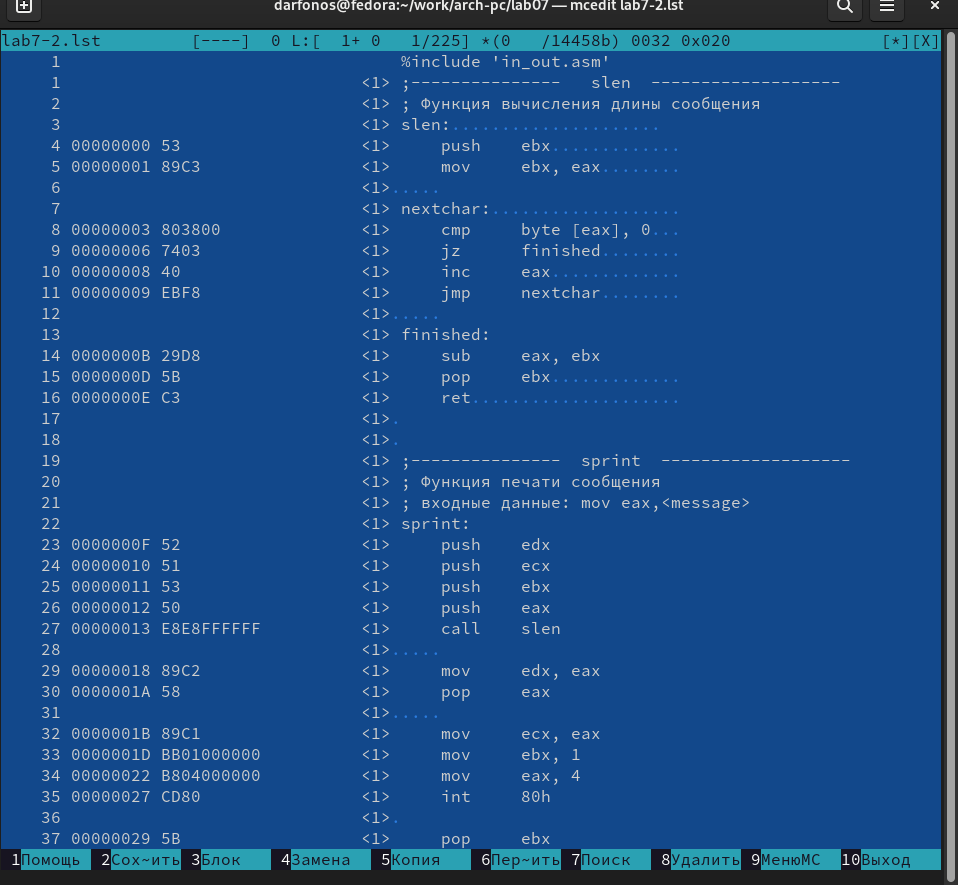{ #fig:013 width=70% }

# Сомтоятельная работа

**14**

Создаю файл lab7-3.asm с помощью утилиты touch (рис. [-@fig:014]).

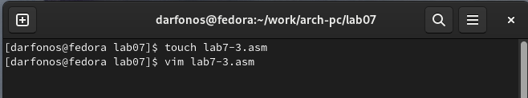{ #fig:014 width=70% }

**15**

Ввожу в созданный файл текст программы для вычисления наибольшего из 3 чисел. Числа беру, учитывая свой вариант из прошлой лабораторной работы. 2 вариант (рис. [-@fig:015]).

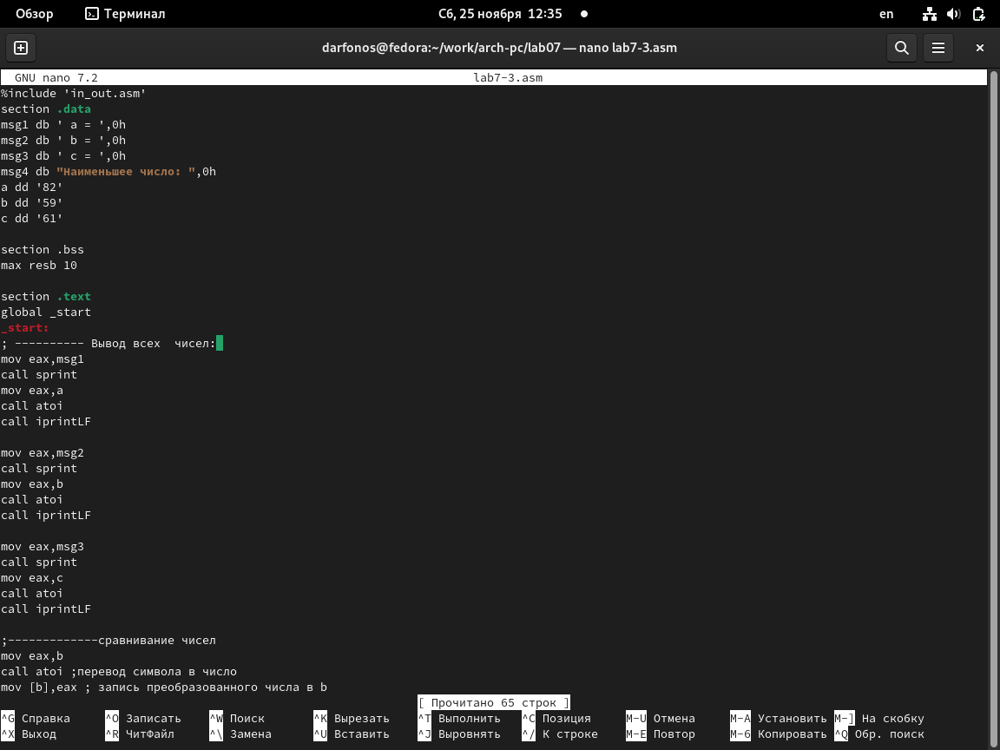{ #fig:015 width=70% }

**16**

Создаю исполняемый файл и запускаю его (рис. [-@fig:016]).

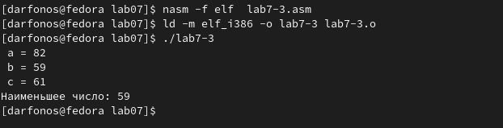{ #fig:016 width=70% }

**Текст программы (рис. [-@fig:015])**

```NASM
%include 'in_out.asm'
section .data
msg1 db ' а = ',0h
msg2 db ' b = ',0h
msg3 db ' c = ',0h
msg4 db "Наибольшее число: ",0h
a dd '82'
b dd '59'
c dd '61'

section .bss
max resb 10

section .text
global _start
_start:
; ---------- Вывод всех  чисел: 
mov eax,msg1
call sprint
mov eax,a
call atoi
call iprintLF

mov eax,msg2
call sprint
mov eax,b
call atoi
call iprintLF

mov eax,msg3
call sprint
mov eax,c
call atoi
call iprintLF

;-------------сравнивание чисел
mov eax,b
call atoi ;перевод символа в число
mov [b],eax ; запись преобразованного числа в b
;------------ запись b в переменную мах
mov ecx,[a] ;
mov [max],ecx ;
;------------сравнивание чисел a c
cmp ecx,[c]; if a>c
jg check_b ; то перход на метку
mov ecx,[c] ;
mov [max],ecx ;
;-------метка check_b
check_b:
mov eax,max ;
call atoi
mov [max],eax ;
;------------
mov ecx,[max] ;
cmp ecx,[b] ;
jg check_c ;
mov ecx,[b] ;
mov [max],ecx ;
;-------------
check_c:
mov eax,msg4 ;
call sprint ; 
mov eax,[max];
call iprintLF ;
call quit

```

**17**

Создаю новый файл lab7-4 для написания программы второго задания. (рис. [-@fig:017]). 

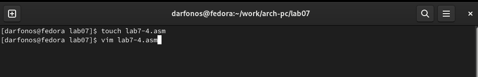{ #fig:017 width=70% }

**18**

Ввожу в него программу, (рис. [-@fig:018]).  в которую ввожу 2 значения x и a, и которая выводит значения функции. Функцию беру из таблицы в соответствии со своим вариантом (Вариант рис. [-@fig:023]). 

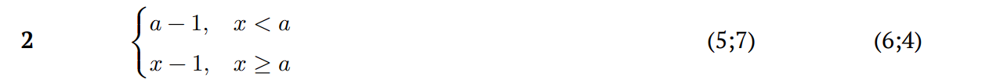{ #fig:023 width=70% }

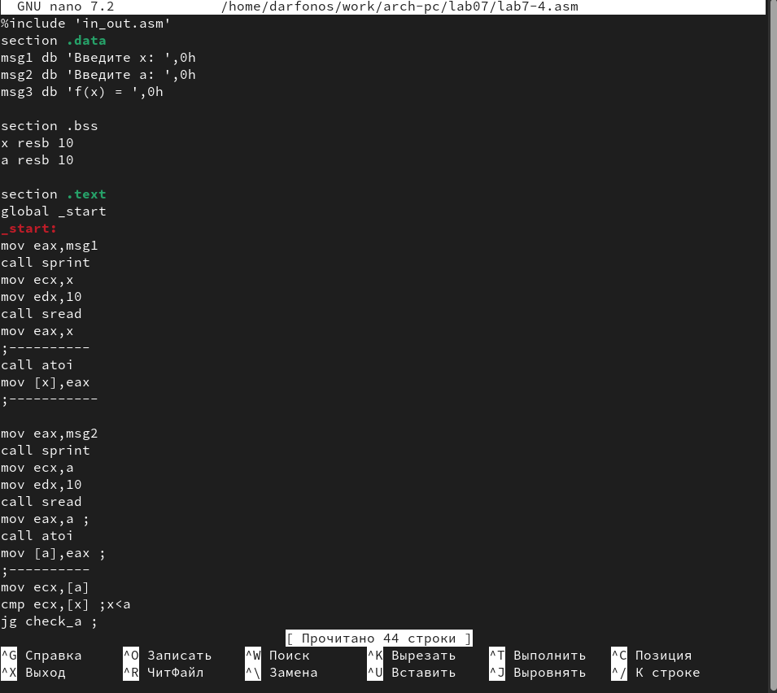{ #fig:018 width=70% }

**19**

Создаю испольняемый файл и проверяю её выполнение при x=5, a=7 (рис. [-@fig:019]).
Программа отработала верно!

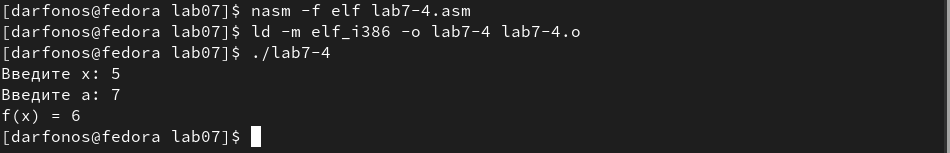{ #fig:019 width=70% }

**20**

Повторный раз запускаю программу и проверяю ее выполнение  при x=6 и a=4 (рис. [-@fig:020]).
Программа отработала верно!

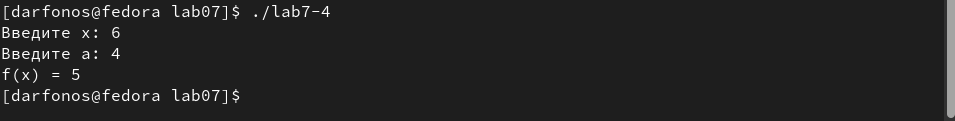{ #fig:020 width=70% }


**Текст программы (рис. [-@fig:018])**

```NASM
%include 'in_out.asm'
section .data
msg1 db 'Введите x: ',0h
msg2 db 'Введите a: ',0h
msg3 db 'f(x) = ',0h

section .bss
x resb 10
a resb 10

section .text
global _start
_start:
mov eax,msg1
call sprint
mov ecx,x
mov edx,10
call sread
mov eax,x
;----------
call atoi
mov [x],eax
;-----------

mov eax,msg2
call sprint
mov ecx,a
mov edx,10
call sread
mov eax,a ;
call atoi
mov [a],eax ;
;----------
mov ecx,[a]
cmp ecx,[x] ;x<a
jg check_a ;
mov ecx,[x]
check_a:
add ecx,-1;
mov eax,msg3 ;
call sprint ;
mov eax,ecx ;
call iprintLF;
call quit ;

```

# Выводы

При выполнении данной лабораторной работы я освоил инструкции условного и безусловного вывода и ознакомился с структурой файла листинга.ы
