---
## Front matter
title: "Отчёт по лабораторной работе №7"
subtitle: "Дисциплина: архитектура компьютера"
author: "Аветисян Алина Эдуардовна"

## Generic otions
lang: ru-RU
toc-title: "Содержание"

## Bibliography
bibliography: bib/cite.bib
csl: pandoc/csl/gost-r-7-0-5-2008-numeric.csl

## Pdf output format
toc: true # Table of contents
toc-depth: 2
lof: true # List of figures
lot: true # List of tables
fontsize: 12pt
linestretch: 1.5
papersize: a4
documentclass: scrreprt
## I18n polyglossia
polyglossia-lang:
  name: russian
  options:
	- spelling=modern
	- babelshorthands=true
polyglossia-otherlangs:
  name: english
## I18n babel
babel-lang: russian
babel-otherlangs: english
## Fonts
mainfont: PT Serif
romanfont: PT Serif
sansfont: PT Sans
monofont: PT Mono
mainfontoptions: Ligatures=TeX
romanfontoptions: Ligatures=TeX
sansfontoptions: Ligatures=TeX,Scale=MatchLowercase
monofontoptions: Scale=MatchLowercase,Scale=0.9
## Biblatex
biblatex: true
biblio-style: "gost-numeric"
biblatexoptions:
  - parentracker=true
  - backend=biber
  - hyperref=auto
  - language=auto
  - autolang=other*
  - citestyle=gost-numeric
## Pandoc-crossref LaTeX customization
figureTitle: "Рис."
tableTitle: "Таблица"
listingTitle: "Листинг"
lofTitle: "Список иллюстраций"
lotTitle: "Список таблиц"
lolTitle: "Листинги"
## Misc options
indent: true
header-includes:
  - \usepackage{indentfirst}
  - \usepackage{float} # keep figures where there are in the text
  - \floatplacement{figure}{H} # keep figures where there are in the text
---

# Цели работы

 Целями работы являются изучение команд условного и безусловного переходов, приобретение навыков написания программ с использованием переходов, знакомство с назначением и структурой файла листинга.

# Выполнение лабораторной работы

Создаю каталог для программ лабораторной работы № 7, перехожу в него и создаю файл lab7-1.asm.

{#fig:001 width=70%}

Открываю созданный файл lab7-1.asm, вставляю в него программу с использованием инструкции jmp( Листинг 7.1).

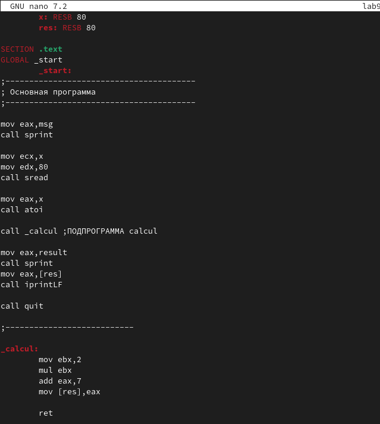{#fig:001 width=70%}

Создаю исполняемый файл и запускаю его.

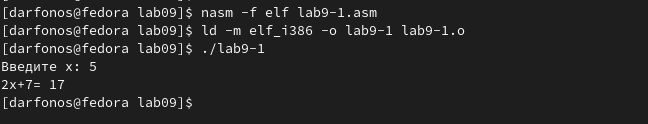{#fig:001 width=70%}

Изменяю текст программы в файле lab7-1.asm в соответствии с Листингом 7.2.

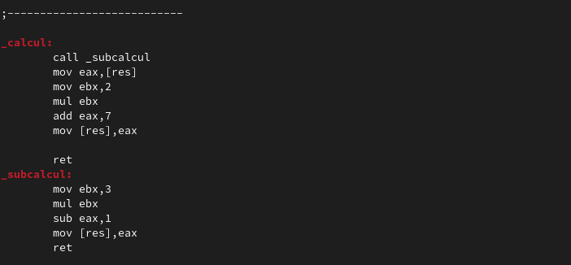{#fig:001 width=70%}

Создаю исполняемый файл и проверяю его работу.

{#fig:001 width=70%}

Изменяю текст программы изменив инструкции jmp.

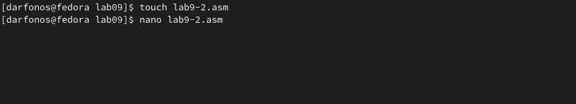{#fig:001 width=70%}

Создаю исполняемый файл и проверяю его работу.

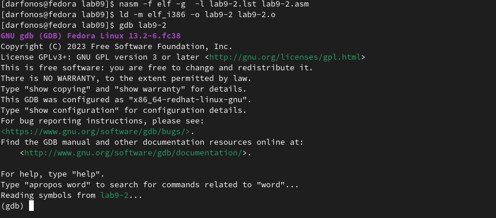{#fig:001 width=70%}

Создаю файл lab7-2.asm в каталоге ~/work/arch-pc/lab07.

{#fig:001 width=70%}

Ввожу в lab7-2.asm программу, которая определяет и выводит на экран наибольшую из 3
целочисленных переменных: A,B и C(Листинг 7.3).

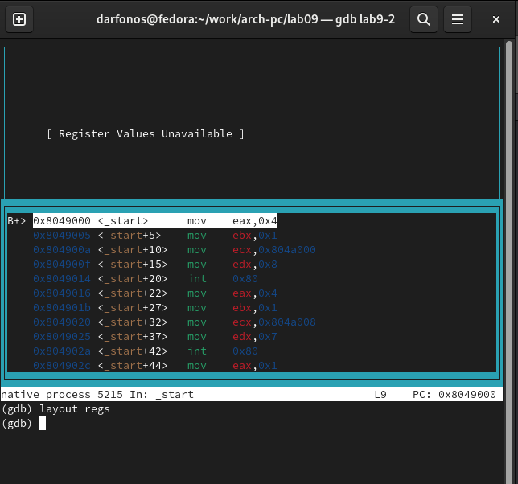{#fig:001 width=70%}

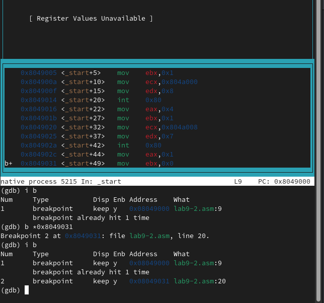{#fig:001 width=70%}

Создаю исполняемый файл и проверяю его работу для разных значений B: 35 и 70.

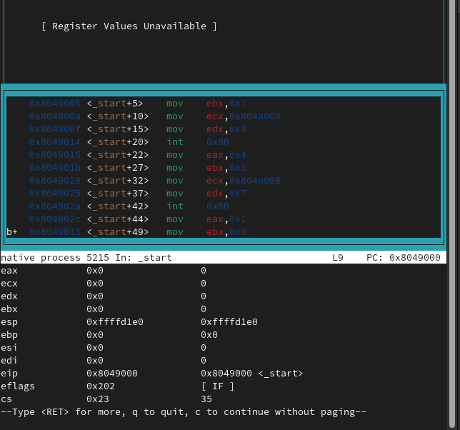{#fig:001 width=70%}

Создаю файл листинга для программы из файла lab7-2.asm.

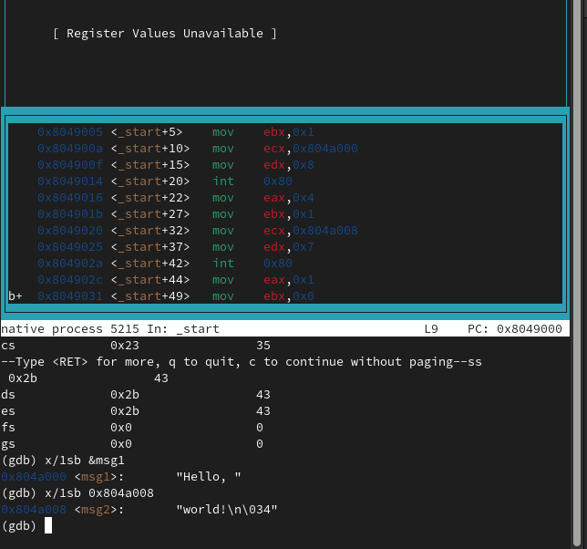{#fig:001 width=70%}

Открываю файл листинга lab7-2.lst с помощью mcedit.

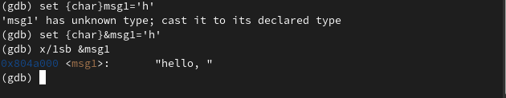{#fig:001 width=70%}

 Рассмотрим 5, 9 и 10 строки.

{#fig:001 width=70%}

5 строка:

• Первые цифры [5] - это номер строки файла листинга.

• Cледующие цифры [00000000] адрес — это смещение машинного кода от
начала текущего сегмента, состоит из 8 чисел.

• Следующие числа [53] - это машинный код, который представляет собой
ассемблированную исходную строку в виде шестнадцатеричной последовательности,
поэтому и появляются буквы латинского алфавита.

• Следующее [push ebx] - исходный текст программы, которая просто состоит
из строки исходной программы вместе с комментариями.

9 строка:

• Первые цифры [9] - это номер строки файла листинга.

• Cледующие цифры [00000006] адрес — это смещение машинного кода от
начала текущего сегмента, состоит из 8 чисел.

• Следующие числа [7403] - это машинный код, который представляет собой
ассемблированную исходную строку в виде шестнадцатеричной последовательности,
поэтому и появляются буквы латинского алфавита.

• Следующее [jz finished] - исходный текст программы, которая просто состоит
из строки исходной программы вместе с комментариями.

10 строка:

• Первые цифры [10] - это номер строки файла листинга.

• Cледующие цифры [00000008] адрес — это смещение машинного кода от
начала текущего сегмента, состоит из 8 чисел.

• Следующие числа [40] - это машинный код, который представляет собой
ассемблированную исходную строку в виде шестнадцатеричной последова-
тельности, поэтому и появляются буквы латинского алфавита.

• Следующее [inc eax] - исходный текст программы, которая просто состоит из
строки исходной программы вместе с комментариями.

Открываю файл lab7-2.lst с помощью редактора и удаляю один операнд в
инструкции cmp.

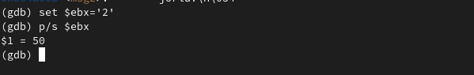{#fig:001 width=70%}

Открываю файл листинга с помощью редактора mcedit и замечаю, что в файле
листинга появляется ошибка.

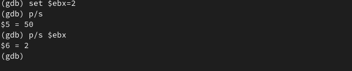{#fig:001 width=70%}

Отсюда можно сделать вывод, что, если в коде появляется ошибка, то ее описание появится в файле листинга.

Выполняю трансляцию с получением файла листинга.

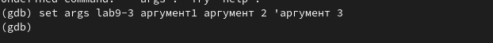{#fig:001 width=70%}

Создаётся файл листинга, в котором есть ошибка.

# Выполнение заданий для самостоятельной работы.

### Задание 1.

Создаю файл lab7-3.asm с помощью утилиты touch.

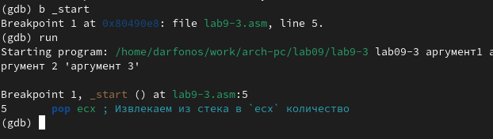{#fig:001 width=70%}

Ввожу в созданный файл текст программы для нахождения наименьшей из 3 целочисленных переменных a,b и c.
Значения переменных беру, учитывая свой вариант из прошлой лабораторной работы, 15
вариант. 

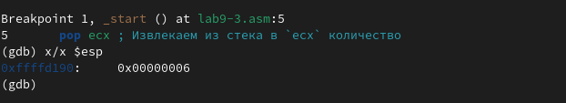{#fig:001 width=70%}

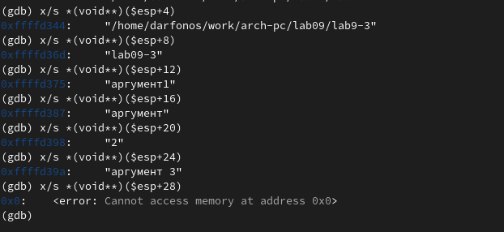{#fig:001 width=70%}

Создаю исполняемый файл и запускаю его.

{#fig:001 width=70%}

### Задание 2.

Создаю новый файл lab7-4 с помощью утилиты touch. 

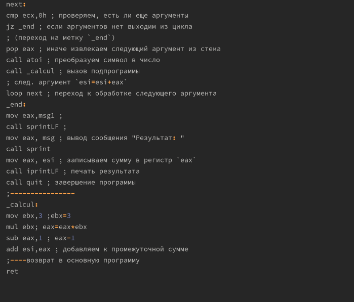{#fig:001 width=70%}

Функцию беру из таблицы в соответствии со своим
вариантом.

{#fig:001 width=70%}

Ввожу в lab7-4.asm программу,в которую ввожу 2 значения x и a, и которая
выводит значения функции.

{#fig:001 width=70%}

Создаю испольняемый файл и проверяю его выполнение при x=2, a=3. Программа отработала верно.

{#fig:001 width=70%}

Повторный раз запускаю программу и проверяю его выполнение при x=4 и a=2. Программа отработала верно.
 
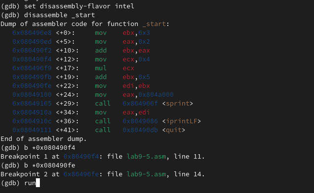{#fig:001 width=70%}

# Выводы

При выполнении данной лабораторной работы я освоила инструкции условного
и безусловного вывода и ознакомилась с структурой файла листинга.

::: {#refs}
:::
