---
## Front matter
title: "Отчёт по лабораторной работе №8"
subtitle: "Дисциплина: архитектура компьютера"
author: "Аветисян Алина Эдуардовна"

## Generic otions
lang: ru-RU
toc-title: "Содержание"

## Bibliography
bibliography: bib/cite.bib
csl: pandoc/csl/gost-r-7-0-5-2008-numeric.csl

## Pdf output format
toc: true # Table of contents
toc-depth: 2
lof: true # List of figures
lot: true # List of tables
fontsize: 12pt
linestretch: 1.5
papersize: a4
documentclass: scrreprt
## I18n polyglossia
polyglossia-lang:
  name: russian
  options:
	- spelling=modern
	- babelshorthands=true
polyglossia-otherlangs:
  name: english
## I18n babel
babel-lang: russian
babel-otherlangs: english
## Fonts
mainfont: PT Serif
romanfont: PT Serif
sansfont: PT Sans
monofont: PT Mono
mainfontoptions: Ligatures=TeX
romanfontoptions: Ligatures=TeX
sansfontoptions: Ligatures=TeX,Scale=MatchLowercase
monofontoptions: Scale=MatchLowercase,Scale=0.9
## Biblatex
biblatex: true
biblio-style: "gost-numeric"
biblatexoptions:
  - parentracker=true
  - backend=biber
  - hyperref=auto
  - language=auto
  - autolang=other*
  - citestyle=gost-numeric
## Pandoc-crossref LaTeX customization
figureTitle: "Рис."
tableTitle: "Таблица"
listingTitle: "Листинг"
lofTitle: "Список иллюстраций"
lotTitle: "Список таблиц"
lolTitle: "Листинги"
## Misc options
indent: true
header-includes:
  - \usepackage{indentfirst}
  - \usepackage{float} # keep figures where there are in the text
  - \floatplacement{figure}{H} # keep figures where there are in the text
---

# Цель работы

Целью работы является приобретение навыков написания программ с использованием циклов и обработкой
аргументов командной строки.

# Выполнение лабораторной работы

Создаю каталог для программ лабораторной работы No 8, перехожу в него и создаю файл lab8-1.asm.

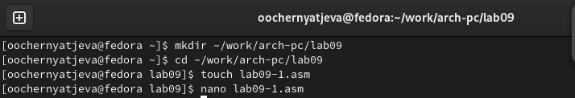{#fig:001 width=70%}

Открываю созданный файл lab8-1.asm, вставляю в него программу вывода значений регистра ecx.

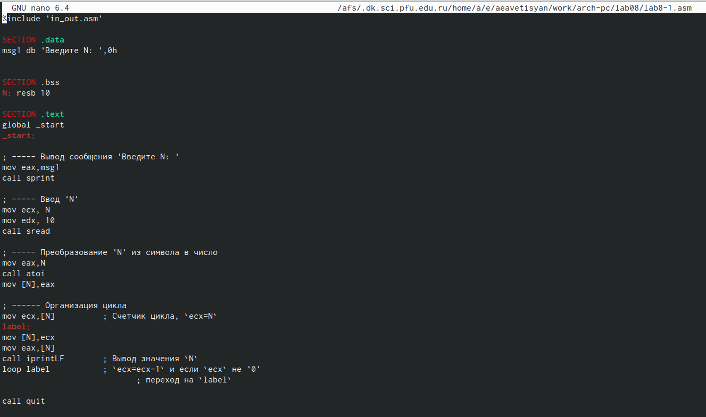{#fig:001 width=70%}

Создаю исполняемый файл и проверяю его работу. Беру значение N=12.

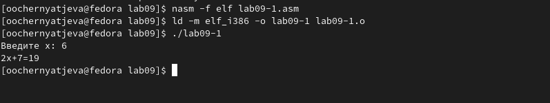{#fig:001 width=70%}

Изменяю текст программы в файле lab8-1.asm.

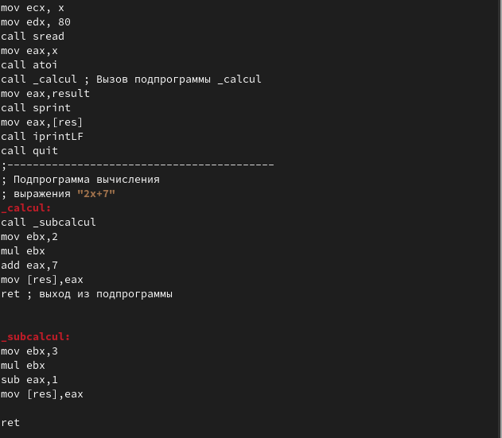{#fig:001 width=70%}

Создаю исполняемый файл и проверяю его работу.

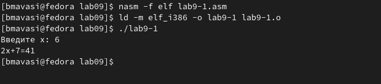{#fig:001 width=70%}

Регистр ecx уменьшается на 2 в цикле. Число проходов не соответствует значению N введенному с клавиатуры.

Вношу изменения в текст программы добавив команды push и pop (добавления в стек и извлечения из стека) для сохранения значения счетчика цикла loop.

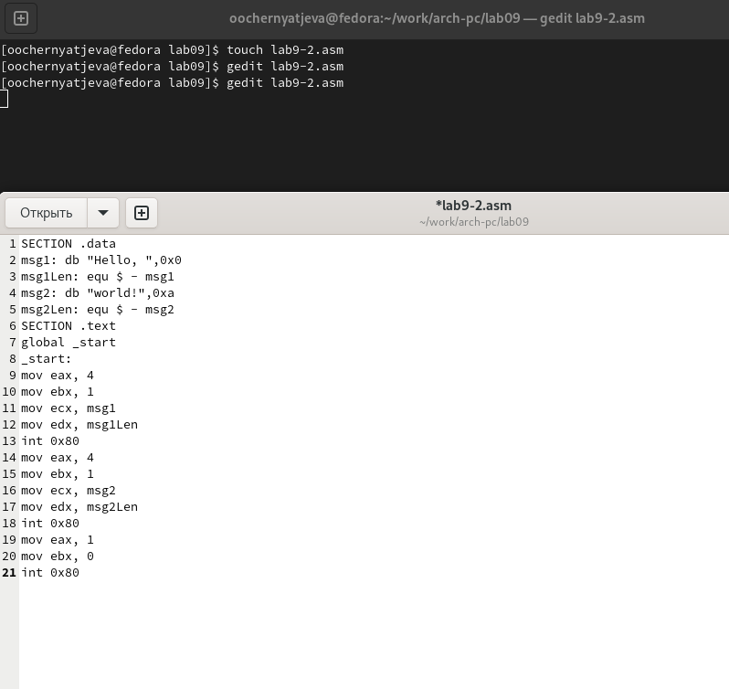{#fig:001 width=70%}

Создаю исполняемый файл и проверяю его работу.

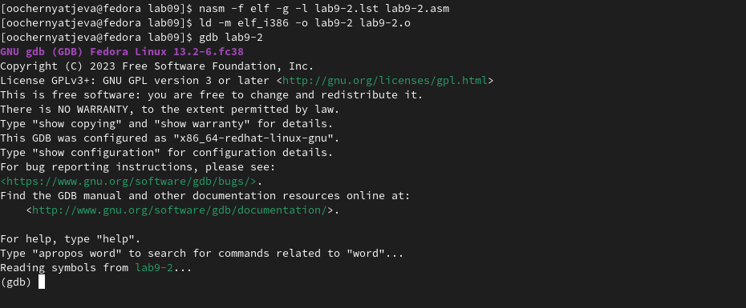{#fig:001 width=70%}

В данном случае число проходов цикла соответствует значению 𝑁 введенному с клавиатуры(12=12).

Создаю файл lab8-2.asm в каталоге ~/work/arch-pc/lab08 и ввожу в него текст про-
граммы из листинга 8.2(программу выводящую на экран аргументы командной строки).

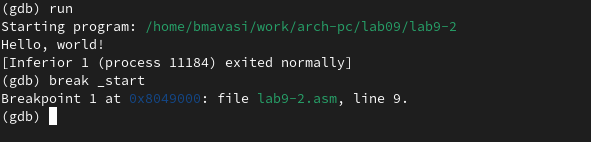{#fig:001 width=70%}

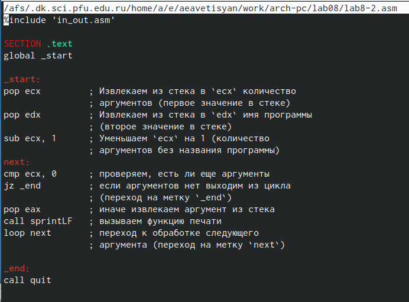{#fig:001 width=70%}

Создаю исполняемый файл и запускаю его, указав аргументы.

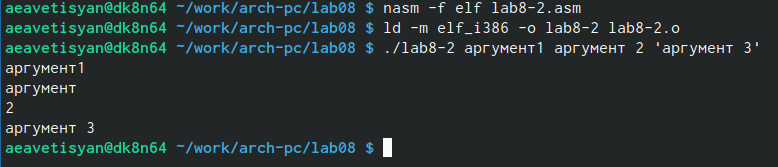{#fig:001 width=70%}

Аргументов было обработано программой : 4.

Создаю файл lab8-3.asm в каталоге ~/work/arch-pc/lab08 и ввожу в него текст программы из листинга 8.3(программу вычисления суммы аргументов командной строки).

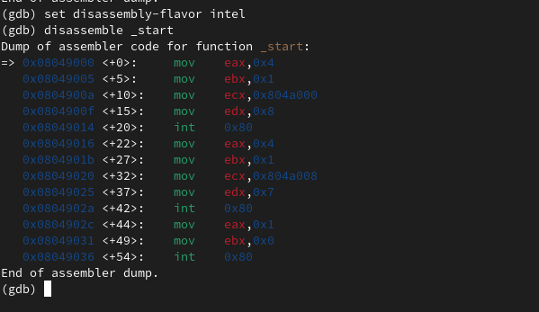{#fig:001 width=70%}

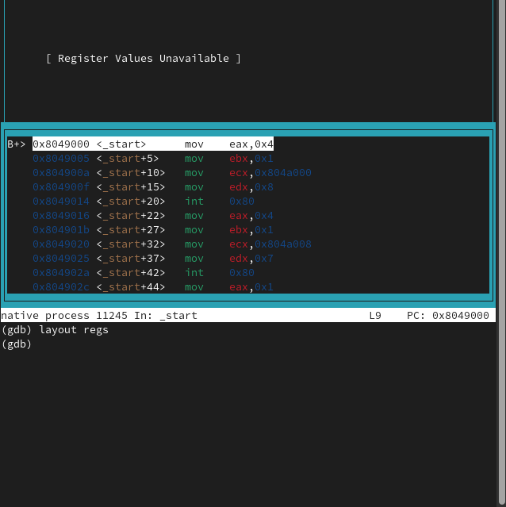{#fig:001 width=70%}

Создаю исполняемый файл и запускаю его, указав аргументы.

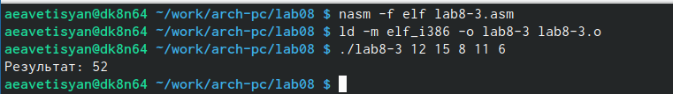{#fig:001 width=70%}

Изменяю текст программы из листинга 8.3 для вычисления произведения аргументов командной строки.

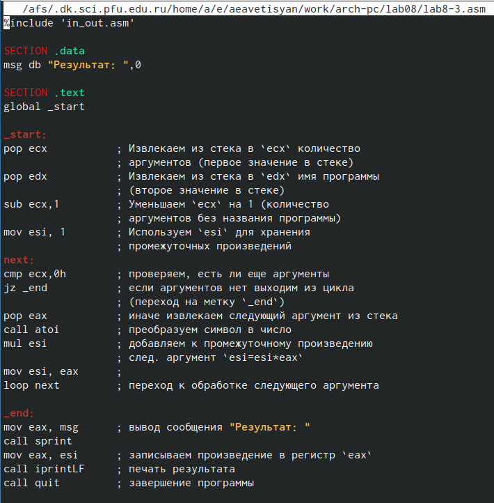{#fig:001 width=70%}

Создаю исполняемый файл и проверяю его работу.

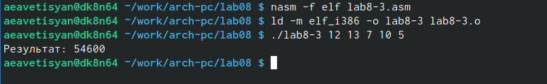{#fig:001 width=70%}

# Задание для самостоятельной работы

Создаю файл lab8-4.asm с помощью утилиты touch.

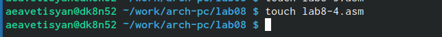{#fig:001 width=70%}

Пишу программу, которая находит сумму значений функции f(x)=6𝑥 + 13( Вариант 15) для
𝑥 = 𝑥1, 𝑥2, ..., 𝑥𝑛, т.е. программа должна выводить значение 𝑓(𝑥1) + 𝑓(𝑥2) + ... + 𝑓(𝑥𝑛).
Значения 𝑥𝑖 передаются как аргументы.

{#fig:001 width=70%}

Создаю исполняемый файл и проверяю его работу.

{#fig:001 width=70%}

# Выводы

При выполнении данной лабораторной работы я приобрела навыки написания программ с использованием циклов и обработкой аргументов командной строки.

::: {#refs}
:::
