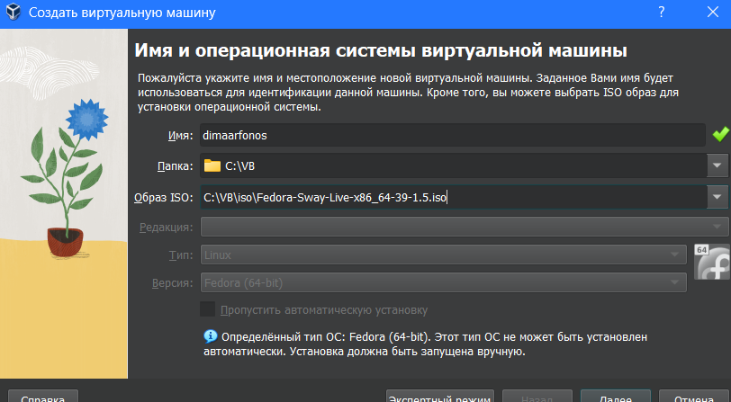
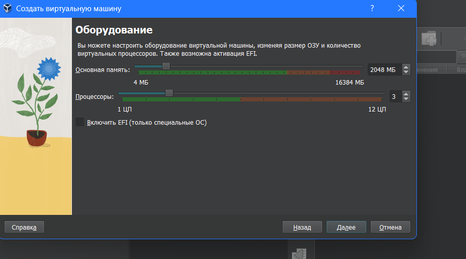
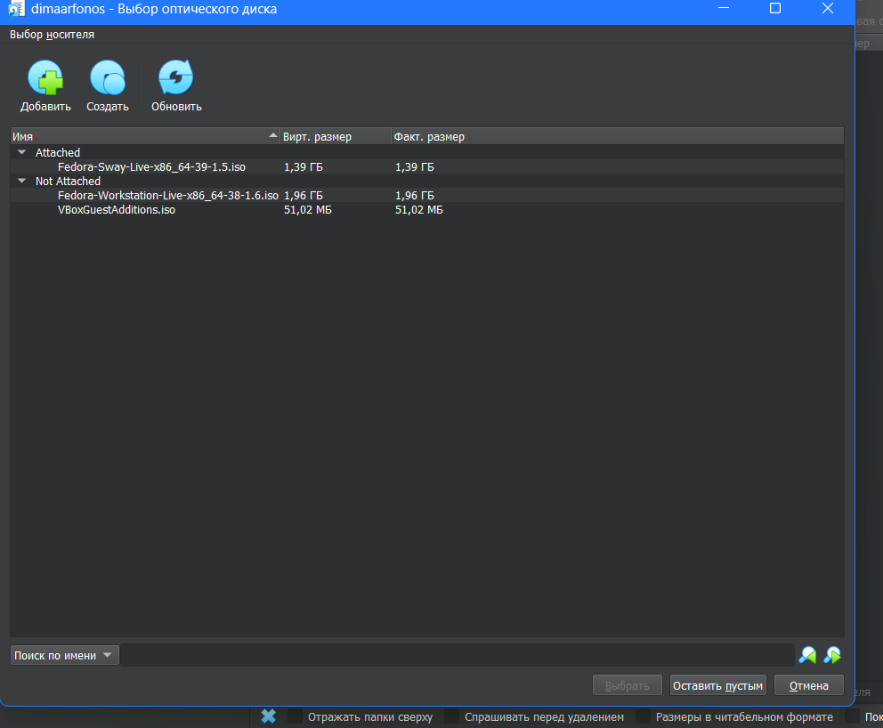
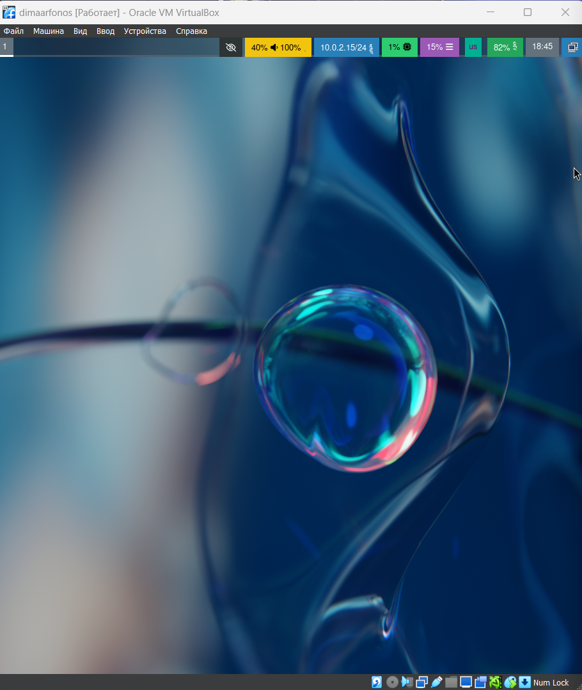
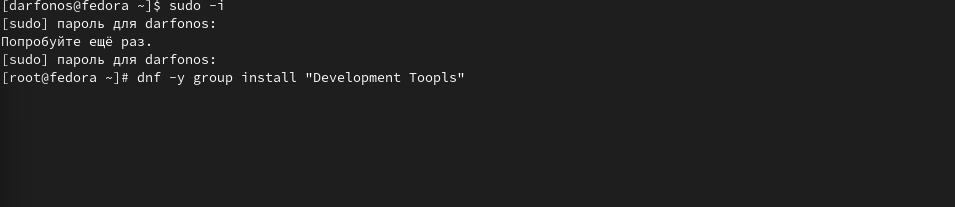
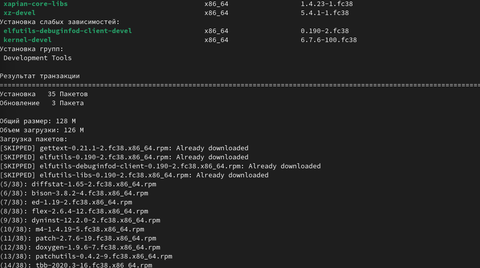

---
## Front matter
lang: ru-RU
title: презентация по лабораторной работе
subtitle: презентация
author:
  - Арфонос Дмитрий
institute:
  - Российский университет дружбы народов, Москва, Россия
  - ФФМиЕН
date: 2 марта 2024

## i18n babel
babel-lang: russian
babel-otherlangs: english

## Formatting pdf
toc: false
toc-title: Содержание
slide_level: 12
aspectratio: 169
section-titles: true
theme: metropolis
header-includes:
 - \metroset{progressbar=frametitle,sectionpage=progressbar,numbering=fraction}
 - '\makeatletter'
 - '\beamer@ignorenonframefalse'
 - '\makeatother'
---

# Информация

:::::::::::::: {.columns align=center}
::: {.column width="70%"}

  * Арфонос Дмитрий
  * д.ф.-м.н., профессор
  * профессор кафедры прикладной информатики и теории вероятностей
  * Российский университет дружбы народов
  * [kulyabov-ds@rudn.ru](mailto:kulyabov-ds@rudn.ru)
  * <https://yamadharma.github.io/ru/>

:::
::: {.column width="30%"}

:::
::::::::::::::

:::::::::::::: {.columns align=center}
::: {.column width="70%"}
## Цель презентации

Целью данной работы является приобретение практических навыков установки операционной системы на виртуальную машину, настройки минимально необходимых для дальнейшей работы сервисов.

:::::::::::::: {.columns align=center}
::: {.column width="70%"}

## Соаздание виртуальной машины

Создаю виртуальную машину: выбираю установленный привод оптических дисков и даю ей имя своего логина(рис. [-@fig:003])

{ #fig:003 width=70% }

:::::::::::::: {.columns align=center}
::: {.column width="70%"}

## Настраиваем виртуальную машину

Устанавливаю обьем оперативной памяти 2 гб и 3 цп (рис. [-@fig:004])

{ #fig:004 width=70% }

:::::::::::::: {.columns align=center}
::: {.column width="70%"}

## Ждем пока все установится и перезагружаем машину

Ждем пока все установится для работы.(рис. [-@fig:010])

{ #fig:010 width=70% }

:::::::::::::: {.columns align=center}
::: {.column width="70%"}

## Привод оптических дисков

Добавляю новый привод оптических дисков.(рис. [-@fig:011])

{ #fig:011 width=70% }

:::::::::::::: {.columns align=center}
::: {.column width="70%"}

## Запуск машины

Запускаю виртуальную машину.(рис. [-@fig:012])

{ #fig:012 width=70% }

:::::::::::::: {.columns align=center}
::: {.column width="70%"}

## Установка необходимых драйверов

Установливаю средства разработки для драйверов виртуал бокс.(рис. [-@fig:019])

{ #fig:019 width=70% }

{ #fig:019 width=70% }

:::::::::::::: {.columns align=center}
::: {.column width="70%"}

## Результат

В результате у меня получилось установить виртуальную машину федора на свой пк, и так же получилось ее настроить для дальнейшей работы.

:::::::::::::: {.columns align=center}
::: {.column width="70%"}

## Вывод:

В данной лабораторной работе я приобрел практические навыки установки операционной системы на виртуальную машину на Windows 11, и научился настроивать минимально необходимые для дальнейшей работы сервисы.

:::