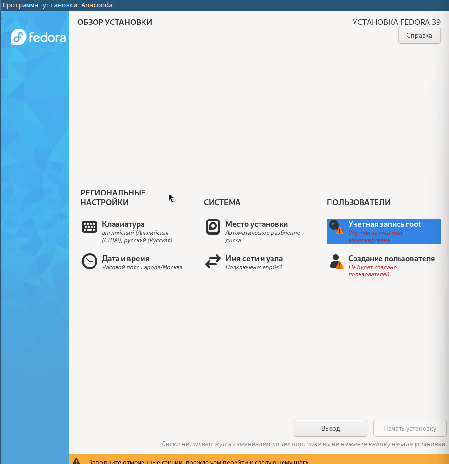
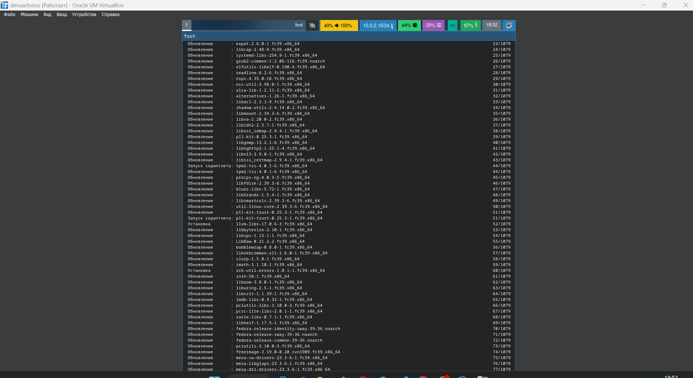
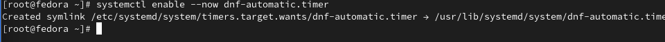
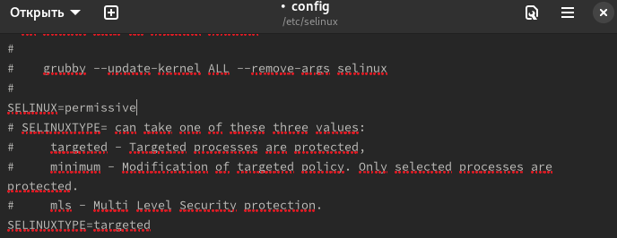
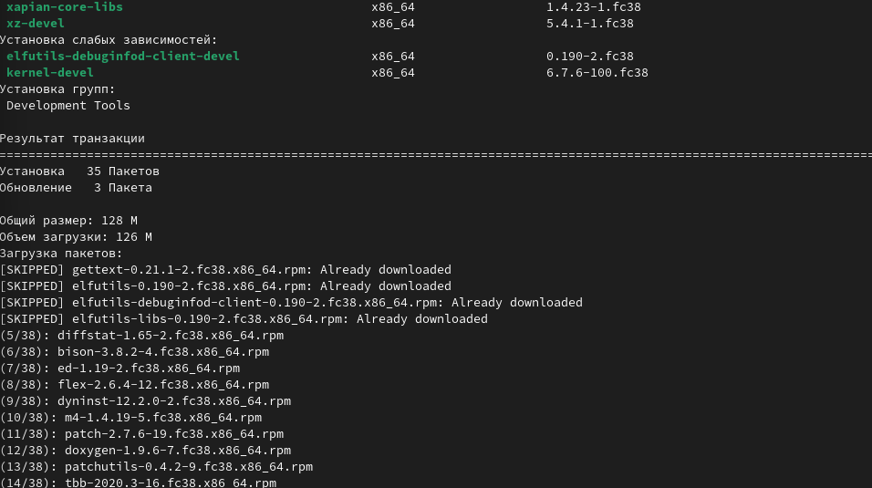
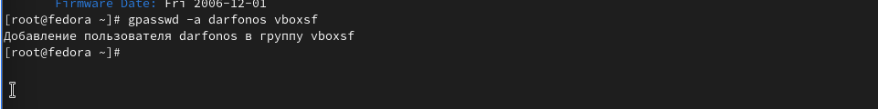
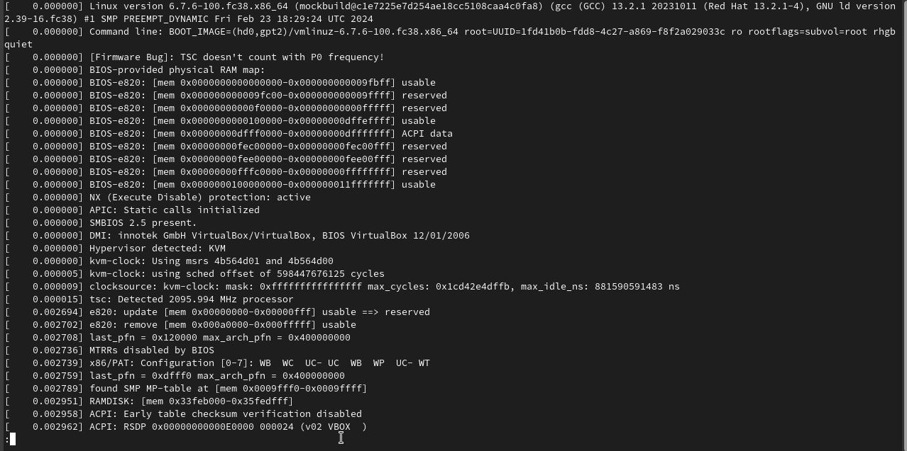
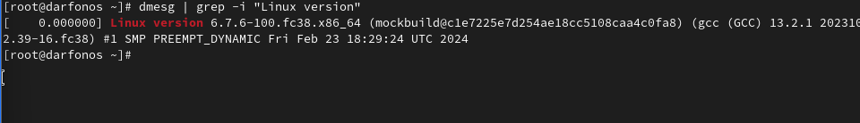
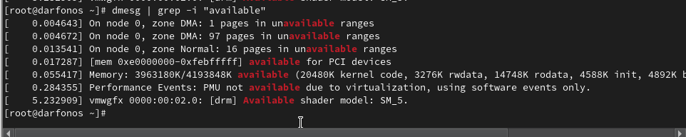

---
## Front matter
title: "Отчёт по лабораторной работе 1"
subtitle: "Простейший вариант"
author: "Арфонос Дмитрий"

## Generic otions
lang: ru-RU
toc-title: "Содержание"

## Bibliography
bibliography: bib/cite.bib
csl: pandoc/csl/gost-r-7-0-5-2008-numeric.csl

## Pdf output format
toc: true # Table of contents
toc-depth: 2
lof: true # List of figures
fontsize: 12pt
linestretch: 1.5
papersize: a4
documentclass: scrreprt
## I18n polyglossia
polyglossia-lang:
  name: russian
  options:
	- spelling=modern
	- babelshorthands=true
polyglossia-otherlangs:
  name: english
## I18n babel
babel-lang: russian
babel-otherlangs: english
## Fonts
mainfont: PT Serif
romanfont: PT Serif
sansfont: PT Sans
monofont: PT Mono
mainfontoptions: Ligatures=TeX
romanfontoptions: Ligatures=TeX
sansfontoptions: Ligatures=TeX,Scale=MatchLowercase
monofontoptions: Scale=MatchLowercase,Scale=0.9
## Biblatex
biblatex: true
biblio-style: "gost-numeric"
biblatexoptions:
  - parentracker=true
  - backend=biber
  - hyperref=auto
  - language=auto
  - autolang=other*
  - citestyle=gost-numeric
## Pandoc-crossref LaTeX customization
figureTitle: "Рис."
listingTitle: "Листинг"
lofTitle: "Список иллюстраций"
lolTitle: "Листинги"
## Misc options
indent: true
header-includes:
  - \usepackage{indentfirst}
  - \usepackage{float} # keep figures where there are in the text
  - \floatplacement{figure}{H} # keep figures where there are in the text
---

# Цель работы

Целью данной работы является приобретение практических навыков установки операционной системы на виртуальную машину, настройки минимально необходимых для дальнейшей работы сервисов.

***

# Выполнение лабораторной работы

 **1**
Настроиваю каталог для виртуальной машины (рис. [-@fig:001])

{  #fig:001 width=70%  }

 **2**
Настроиваю хост-клавиши с ctrl на num-lock (рис. [-@fig:002])

{  #fig:002 width=70%  }

 **3**
Создаю виртуальную машину: выбираю установленный привод оптических дисков и даю ей имя своего логина(рис. [-@fig:003])

{ #fig:003 width=70% }

 **4**
Устанавливаю обьем оперативной памяти 2 гб и 3 цп (рис. [-@fig:004])

{ #fig:004 width=70% }

 **5**
Устанавливаю обьем жесткого диска 80 гб (рис. [-@fig:005])

{ #fig:005 width=70% }

 **6**
Устанавливаю обьем видеопамяти(рис. [-@fig:006])

{ #fig:006 width=70% }

 **7**
Создаю учетную запись для виртуальной машины(рис. [-@fig:007])

{ #fig:007 width=70% }

 **8**
Настраиваю дату и время(рис. [-@fig:008])

{ #fig:008 width=70% }

 **9**

Устанавливаю автоматическую конфигурацию.(рис. [-@fig:009])

{ #fig:009 width=70% }

 **10**

Ждем пока все установится для работы.(рис. [-@fig:010])

{ #fig:010 width=70% }

 **11**

Добавляю новый привод оптических дисков.(рис. [-@fig:011])

{ #fig:011 width=70% }

 **12**

Запускаю виртуальную машину.(рис. [-@fig:012])

{ #fig:012 width=70% }

 **13**

Запускаю режим суперпользователя.(рис. [-@fig:013])

{ #fig:013 width=70% }

 **14**

Обновляю все пакеты.(рис. [-@fig:014])

{ #fig:014 width=70% }

{ #fig:014 width=70% }

 **15**

Программа для удобства работы в консоли.(рис. [-@fig:015])

{ #fig:015 width=70% }

 **16**

Ввожу команду для автообновления системы.(рис. [-@fig:016])

{ #fig:016 width=70% }

 **17**

Устанавливаю таймер(рис. [-@fig:017])

{ #fig:017 width=70% }

 **18**

Отключение SELinux изменяя конфигурацию нужной папки (рис. [-@fig:018])

{ #fig:018 width=70% }

 **19**

Установите средства разработки для драйверов виртуал бокс.(рис. [-@fig:019])

{ #fig:019 width=70% }

{ #fig:019 width=70% }

 **20**

Установка dkms(рис. [-@fig:020])

{ #fig:020 width=70% }

 **21**

Подмонтирую диск и запускаю установку драйвера(рис. [-@fig:021])

{ #fig:021 width=70% }

 **22**

Перезагружаю машину(рис. [-@fig:022])

{ #fig:022 width=70% }

 **23**

Установите и проверка имени хоста(рис. [-@fig:023])

{ #fig:023 width=70% }

 **24**

Внутри виртуальной машины добавляю своего пользователя в группу vboxsf(рис. [-@fig:024])

{ #fig:024 width=70% }

 **25**

Устанавливаю пакет pandoc для редактирование текстов(рис. [-@fig:025])

{ #fig:025 width=70% }

 **26**

Устанавливаю из внешних источников репозиторий с pandoc-crossref(рис. [-@fig:026])

{ #fig:026 width=70% }

 **27**

Устанавливаю полную версию пакетов texlive(рис. [-@fig:027])

 {#fig:27 width=70% }

# Самостоятельная работа

**29**

В окне терминала проанализирую последовательность загрузки системы, выполнив команду dmes(рис. [-@fig:028])

{ #fig:028 width=70% }

 **28**

Получаю информацию о Версия ядра Linux(рис. [-@fig:029])

{ #fig:029 width=70% }

 **29**

Узнаю частоту процессора(рис. [-@fig:030])

{ #fig:030 width=70% }

 **30**

Узнаю Модель процессора(рис. [-@fig:031])

{ #fig:031 width=70% }

 **31**

Вывожу на экран объём доступной оперативной памяти(рис. [-@fig:032])

{ #fig:032 width=70% }

 **32**

Тип обнаруженного гипервизора(рис. [-@fig:033])

{ #fig:033 width=70% }

 **33**

Вывожу Тип файловой системы корневого раздела. (CPU0).(рис. [-@fig:034])

{ #fig:034 width=70% }

 **34**

вывожу на экран последовательность монтирования файловых систем.(рис. [-@fig:035])

{ #fig:035 width=70% }

# Вывод

  В данной лабораторной работе я приобрел практические навыки установки операционной системы на виртуальную машину на Windows 11, и научился настроивать минимально необходимые для дальнейшей работы сервисы.
