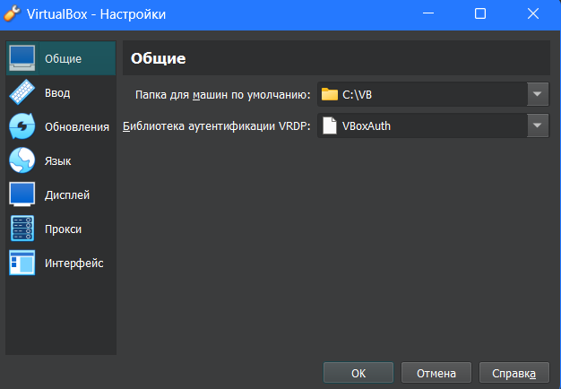
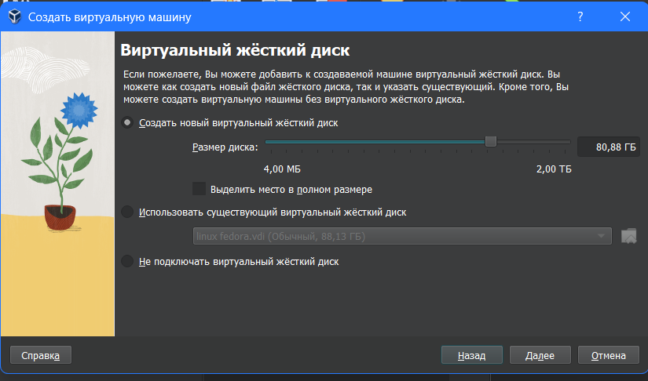
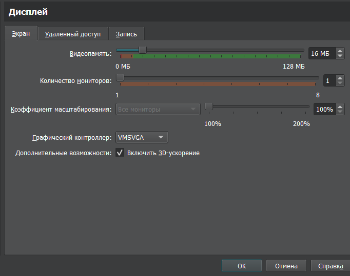
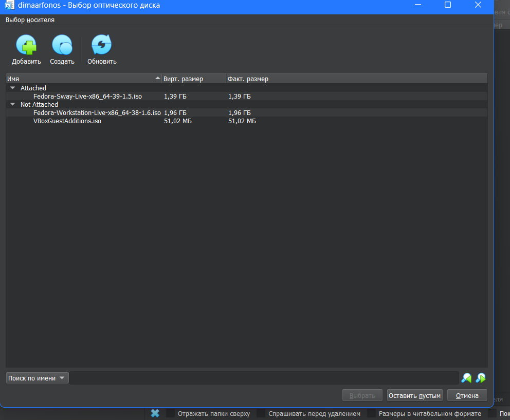
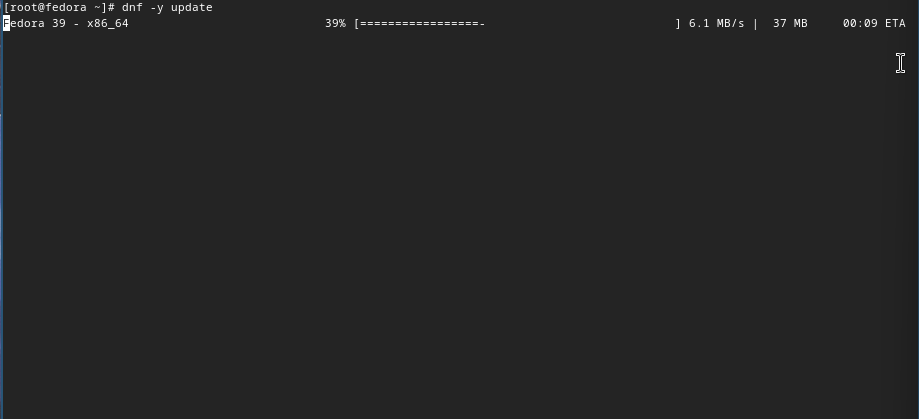
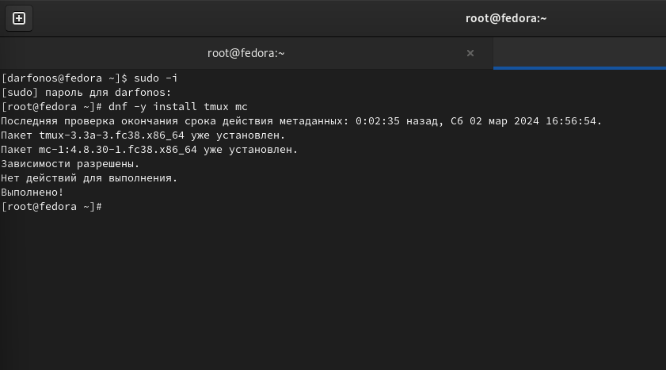

---
## Front matter
title: "Отчёт по лабораторной работе №8"
subtitle: "Дисциплина: архитектура компьютера"
author: "Маваси Башар"

## Generic otions
lang: ru-RU
toc-title: "Содержание"

## Bibliography
bibliography: bib/cite.bib
csl: pandoc/csl/gost-r-7-0-5-2008-numeric.csl

## Pdf output format
toc: true # Table of contents
toc-depth: 2
lof: true # List of figures
fontsize: 12pt
linestretch: 1.5
papersize: a4
documentclass: scrreprt
## I18n polyglossia
polyglossia-lang:
  name: russian
  options:
	- spelling=modern
	- babelshorthands=true
polyglossia-otherlangs:
  name: english
## I18n babel
babel-lang: russian
babel-otherlangs: english
## Fonts
mainfont: PT Serif
romanfont: PT Serif
sansfont: PT Sans
monofont: PT Mono
mainfontoptions: Ligatures=TeX
romanfontoptions: Ligatures=TeX
sansfontoptions: Ligatures=TeX,Scale=MatchLowercase
monofontoptions: Scale=MatchLowercase,Scale=0.9
## Biblatex
biblatex: true
biblio-style: "gost-numeric"
biblatexoptions:
  - parentracker=true
  - backend=biber
  - hyperref=auto
  - language=auto
  - autolang=other*
  - citestyle=gost-numeric
## Pandoc-crossref LaTeX customization
figureTitle: "Рис."
listingTitle: "Листинг"
lofTitle: "Список иллюстраций"
lolTitle: "Листинги"
## Misc options
indent: true
header-includes:
  - \usepackage{indentfirst}
  - \usepackage{float} # keep figures where there are in the text
  - \floatplacement{figure}{H} # keep figures where there are in the text
---

# Цель работы

Получение навыков по организации циклов и работе со стеком на языке NASM.

***

# Выполнение лабораторной работы

**Шаг 1**

С помощью утилиты mkdir создаю директорию lab08, перехожу в нее и создаю файл для работы. (рис. [-@fig:001])

{ #fig:001 width=80% }

***

**Шаг 2**

Открываю созданный файл lab8-1.asm, вставляю в него программу с использованием цикла для вывода чисел(рис. [-@fig:002]).                                               

{ #fig:002 width=80% }

***

**Шаг 3**

Создаю исполняемый файл программы и запускаю его (рис. [-@fig:003]).  

{ #fig:003 width=80% }

***

**Шаг 4**

с помощью инструкции sub уменьшаю изначальный индекс индекс на 1 единичку. (рис. [-@fig:004]). 

{ #fig:004 width=80% }

***

**Шаг 5**

Создаю новый исполняемый файл программы и запускаю его (рис. [-@fig:005]).  Получаем результат отличный от ожидаемого

{ #fig:005 width=80% }

***

**Шаг 6**

Изменяю текст программы так, чтобы получить нужный результат, используя стеки для запоминания данных.  (рис. [-@fig:006]).

{ #fig:006 width=80% }

***

**Шаг 7**

 Создаю исполняемый файл и проверяю работу программы (рис. [-@fig:007]). 

{ #fig:007 width=80% }

- Программа отработало верно.

***

**Шаг 8** 

Создаю новый файл lab8-2.asm для новой программы. (рис. [-@fig:008]).

{ #fig:008 width=80% }

***

**Шаг 9**

Вставляю программу, которая выводит все введенные пользователем аргументы (рис.[-@fig:009]).

{ #fig:009 width=80% }

***

**Шаг 10**

Создаю и запускаю новый исполняемый файл, проверяю работу программы (рис. [-@fig:010]). 

{ #fig:010 width=80% }

- Программой было обработано 4 аргумента.
- Программа считает аргументами все символы до пробела, или значения, которые взяты в ковычки.

***

**Шаг 11**

Создаю новый файл lab8-3.asm (рис. [-@fig:011]).

{ #fig:011 width=80% }

***

**Шаг 12**

Открываю файл и ввожу программу, которая складывает все числа введенные пользователем  (рис. [-@fig:012]).

{ #fig:012 width=80% }

***

**Шаг 13**

Запускаю испольняемый файл и проверяю работу программы (рис. [-@fig:013]).

{ #fig:013 width=80% }

***

**Шаг 14**

Изменяю текст программы так, чтобы она выводила произведение всех чисел, введенные пользователем. (рис. [-@fig:014]).

{ #fig:014 width=80% }

***

**Шаг 15**

Запускаю испольняемый файл и проверяю работу программы (рис. [-@fig:015]).

{ #fig:015 width=80% }

**Программа отработала верно!**

***

# Самостоятельная работа

**Шаг 1**

Создаю файл lab8-4.asm с помощью утилиты touch (рис. [-@fig:016]).

{ #fig:016 width=80% }

***

**Шаг 2**

Ввожу в созданный файл текст программы, у, которая находит сумму значений функции (2 Вариант) f(x)=3x-1 для всех аргументов x, введенные пользовтелем.(рис. [-@fig:017]).

{ #fig:017 width=80% }

***

**Шаг 3**

Создаю исполняемый файл и запускаю его, при x = 5, 3, 6 (рис. [-@fig:018]).

{ #fig:018 width=80% }

**Текст программы**

```NASM
%include 'in_out.asm'
SECTION .data
msg db "Результат: ",0
msg1 db "Функция: f(x)=3(x+2)"
SECTION .text
global _start
_start:
pop ecx ; Извлекаем из стека в `ecx` количество
; аргументов (первое значение в стеке)
pop edx ; Извлекаем из стека в `edx` имя программы
; (второе значение в стеке)
sub ecx,1 ; Уменьшаем `ecx` на 1 (количество
; аргументов без названия программы)
mov esi, 0 ; Используем `esi` для хранения
; промежуточных сумм
next:
cmp ecx,0h ; проверяем, есть ли еще аргументы
jz _end ; если аргументов нет выходим из цикла
; (переход на метку `_end`)
pop eax ; иначе извлекаем следующий аргумент из стека
call atoi ; преобразуем символ в число
add eax,2 ; eax+2
mov ebx,3 ;ebx=3
mul ebx; eax=eax*ebx
add esi,eax ; добавляем к промежуточной сумме
; след. аргумент `esi=esi+eax`
loop next ; переход к обработке следующего аргумента
_end:
mov eax,msg1 ;
call sprintLF ;
mov eax, msg ; вывод сообщения "Результат: "
call sprint
mov eax, esi ; записываем сумму в регистр `eax`
call iprintLF ; печать результата
call quit ; завершение программы

```

***

# Вывод

В ходе выполениния работы были получены навыки по организации циклов и по работе со стеком на языке NASM.