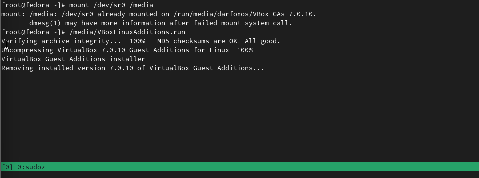
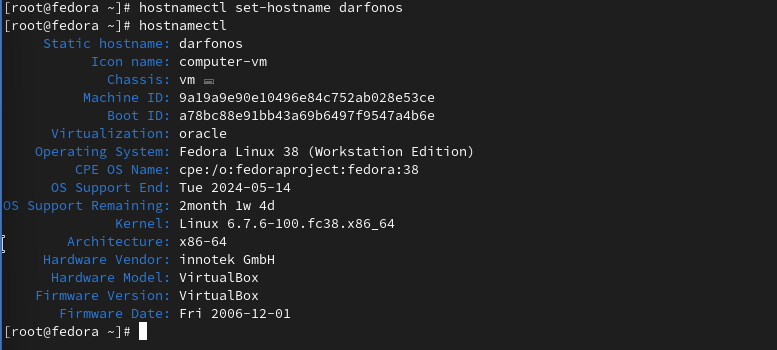
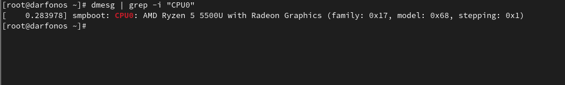

---
## Front matter
title: "Отчёт по лабораторной работе №9"
subtitle: "Дисциплина: архитектура компьютера"
author: "Аветисян Алина Эдуардовна"

## Generic otions
lang: ru-RU
toc-title: "Содержание"

## Bibliography
bibliography: bib/cite.bib
csl: pandoc/csl/gost-r-7-0-5-2008-numeric.csl

## Pdf output format
toc: true # Table of contents
toc-depth: 2
lof: true # List of figures
fontsize: 12pt
linestretch: 1.5
papersize: a4
documentclass: scrreprt
## I18n polyglossia
polyglossia-lang:
  name: russian
  options:
	- spelling=modern
	- babelshorthands=true
polyglossia-otherlangs:
  name: english
## I18n babel
babel-lang: russian
babel-otherlangs: english
## Fonts
mainfont: PT Serif
romanfont: PT Serif
sansfont: PT Sans
monofont: PT Mono
mainfontoptions: Ligatures=TeX
romanfontoptions: Ligatures=TeX
sansfontoptions: Ligatures=TeX,Scale=MatchLowercase
monofontoptions: Scale=MatchLowercase,Scale=0.9
## Biblatex
biblatex: true
biblio-style: "gost-numeric"
biblatexoptions:
  - parentracker=true
  - backend=biber
  - hyperref=auto
  - language=auto
  - autolang=other*
  - citestyle=gost-numeric
## Pandoc-crossref LaTeX customization
figureTitle: "Рис."
listingTitle: "Листинг"
lofTitle: "Список иллюстраций"
lolTitle: "Листинги"
## Misc options
indent: true
header-includes:
  - \usepackage{indentfirst}
  - \usepackage{float} # keep figures where there are in the text
  - \floatplacement{figure}{H} # keep figures where there are in the text
---

# Цель работы

Приобретение навыков написания программ с использованием подпрограмм.  Знакомство с методами отладки при помощи GDB и его основными возможностями.

***

# Выполнение лабораторной работы

**Шаг 1**

С помощью утилиты mkdir создаю директорию lab09, перехожу в нее и создаю файл для работы. (рис. [-@fig:001])

{ #fig:001 width=80% }

**Шаг 2**

Открываю созданный файл lab9-1.asm, вставляю в него программу с использованием подпрограммы(рис.[-@fig:002]).

{ #fig:002 width=80% }

**Шаг 3**

Создаю исполняемый файл программы и запускаю его (рис. [-@fig:003]). 

{ #fig:003 width=80% }

**Шаг 4**

Изменяю текст программы для вычисления композиции f от g, при g(x) = 3x-1.
Создаю новую подпрограмму _subcalcul для вычисления функции g (рис. [-@fig:004]). 

{ #fig:004 width=80% }

**Шаг 5**

Создаю исполняемый файл и проверяю работу программы (рис. [-@fig:005]). 

{ #fig:005 width=80% }

- Программа отработала верно!!

**Шаг 6**

Создаю новый файл lab9-2.asm и вставляю в него текст из Листинга 9.2 (рис. [-@fig:006]).

 { #fig:006 width=80% }

**Шаг 7**

Создаю исполняемый файл, файл листинга для работы с отладчиком GDB (рис. [-@fig:007]). 

{ #fig:007 width=80% }

**Шаг 8** 

Проверяю работу программы, запустив ее в оболочке GDB с помощью команды run, и для более подробного анализа программы, вставляю брэйкпоинт на метку _start (рис. [-@fig:008]).

{ #fig:008 width=80% }

**Шаг 9**

Посмотрим дизассемеблированный код, начиная с этой метки. (рис. [-@fig:010]). 

{ #fig:010 width=80% }

**Шаг 10**

Так же посмотрим как выглядит дизассемблированный код c синтаксисом Intel (рис. [-@fig:011]).

{ #fig:011 width=80% }

- В представлении ATT в виде 16-ричного числа записаны первые аргументы всех комманд, а в представлении intel так записываются адреса вторых аргумантов.

**Шаг 11**

Включим режим псевдографики, с помощью которого отбражается код программы и содержимое регистров (рис. [-@fig:012]).

{ #fig:012 width=80% }

**Шаг 12**

Посмотрим информацию о наших точках останова и сразу добавим еще одну точку .(рис. [-@fig:013]).

{ #fig:013 width=80% }

**Шаг 13**

Так же можно выводить значения регистров. Делается это командой i r. Псевдографика предствалена на (рис. [-@fig:014]).

{ #fig:014 width=80% }

**Шаг 14**

В отладчике можно вывести текущее значение переменных. Сделать это можно по имени или по адресу: выводим значения переменных msg1 и msg2 (рис. [-@fig:015]).

{ #fig:015 width=80% }

**Шаг 15**

Так же отладчик позволяет менять значения переменных прямо во время
выполнения программы (рис. [-@fig:016]).

{ #fig:016 width=80% }

- Заменяю первый символ 'H' на 'h'

**Шаг 16**

Замененяю первый символ переменной msg2 на символ k. (рис. [-@fig:017]).

{ #fig:017 width=80% }

**Шаг 17**

Выоводить можно так же содержимое регисторов. Выведем значение ebx в разных форматах. (рис. [-@fig:018]).

{ #fig:018 width=80% }

**Шаг 18**

Как и переменным, регистрам можно задавать значения (рис. [-@fig:019]).

{ #fig:019 width=80% }

**Шаг 19**

Так же отладчик позволяет менять значения переменных прямо во время выполнения программы (рис. [-@fig:020]).

{ #fig:020 width=80% }

- Однако при попытке задать строчное значение, происходит ошибка.

**Завершим работу в gdb командами continue, она закончит выполнение программы, и exit, она завершит сеанс gdb**

**Шаг 20**

Скопируем файл из лабораторной 9, переименуем её и создадим исполняемый
файл. Откроем отладчик и зададим аргументы. (рис. [-@fig:022]).

{ #fig:022 width=80% }

{ #fig:022 width=80% }

**Шаг 21**

Создадим точку останова на метке _start и запустим программу(рис. [-@fig:023]).

{ #fig:023 width=80% }

**Шаг 22**

Посмотрим на содержимое стека, что расположено по адрессу, находящемуся в регистре esp(рис. [-@fig:025]).

{ #fig:025 width=80% }

**Шаг 23**

Далее посмотрим на все остальные аргументы в стеке. Их адреса распологаются в 4 байтах друг от друга(именно столько занимает элемент стека)  (рис. [-@fig:026]).

{ #fig:026 width=80% }

# Самостоятельная работа

## Здание №1

**Шаг 1**

Копирую  программу из лабороторной 8 и переименовываю его. Изменяю текст программы  с использованием подпрограммы (рис. [-@fig:028]).

{ #fig:028 width=80% }

**Шаг 3**

Создаю исполняемый файл и проверяю работу изменённой программы .(рис. [-@fig:029]).

{ #fig:029 width=80% }

**Программа отработала верно**

## Задание №2

**Шаг 1**

Создаю новый файл и вставляю в него программу из листинга (рис. [-@fig:030]).

{ #fig:030 width=80% }

**Шаг 2**

Запускаю программу в отладчике и проверяю его работу и вижу, что результат вычисления неправильный. (рис. [-@fig:031]).

{ #fig:031 width=80% }

{ #fig:031 width=80% }

**Шаг 3**

Для того, чтобы найти ошибку дисассемблирую программу и добавляю брейкпоинты  в основной части программы (рис. [-@fig:033]).

{ #fig:033 width=80% }

**Шаг 4**

Запускаю программу до первой точки останова, и проверяю значения регистров. 

- Замечаю, что результат сложение записывается в регистр ebx. (рис. [-@fig:034]).

{ #fig:034 width=80% }

**Шаг 5**

Перехожу к следующему брейкпоинту и снова проверяю какие значения принимают регистры. (рис. [-@fig:035]).

- Замечаю, что умножение регистра ecx происходит на регистр eax(4*2), а к регистру ebx плюсуется 5 (5+5) и его значенние записыватся в результат программы.

{ #fig:035 width=80% }

**Шаг 6**

Исправляю основные ошибки выявленные с помощью отладчика GDB. (рис. [-@fig:036]).

{ #fig:036 width=80% }

**Шаг 7**

Создаю исполняемый файл и проверяю работу программы.  (рис. [-@fig:037]).

{ #fig:037 width=80% }

**Программа отработала без ошибок!!**

# Вывод

В результате выполнения 9-ой лабораторной работы, я научилась организовывать код в подпрограммы и познакомилась с базовыми функциями отладчика GDB.

