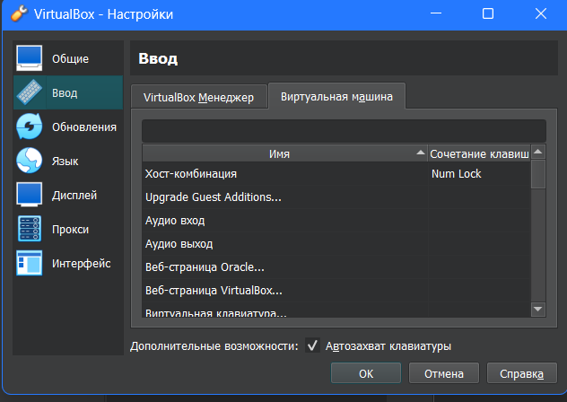
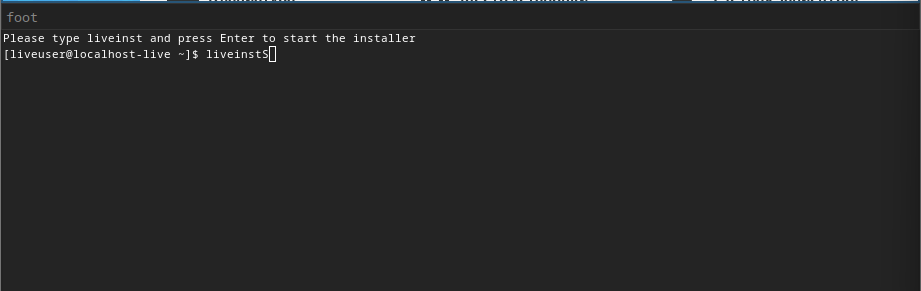
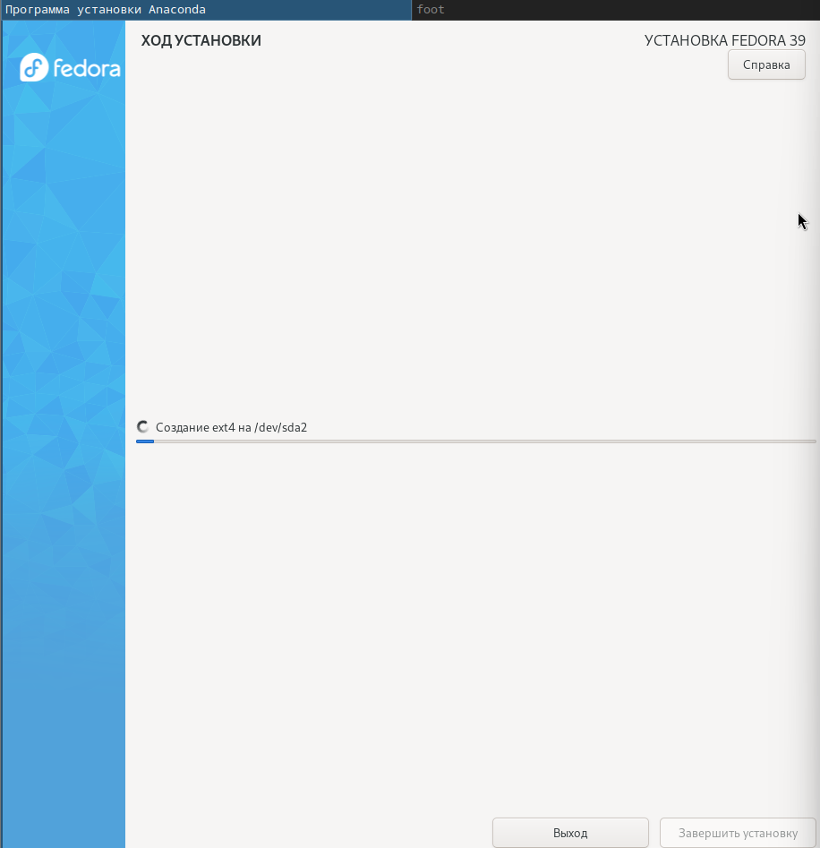
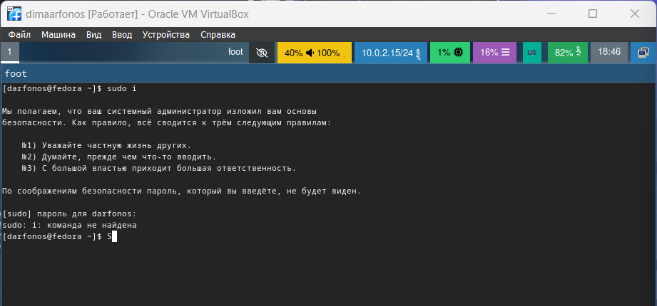

---
## Front matter
title: "Отчёт по лабораторной работе №10"
subtitle: "Дисциплина: Архитектура компьютера"
author: "Аветисян Алина Эдуардовна"

## Generic otions
lang: ru-RU
toc-title: "Содержание"

## Bibliography
bibliography: bib/cite.bib
csl: pandoc/csl/gost-r-7-0-5-2008-numeric.csl

## Pdf output format
toc: true # Table of contents
toc-depth: 2
lof: true # List of figures
lot: true # List of tables
fontsize: 12pt
linestretch: 1.5
papersize: a4
documentclass: scrreprt
## I18n polyglossia
polyglossia-lang:
  name: russian
  options:
	- spelling=modern
	- babelshorthands=true
polyglossia-otherlangs:
  name: english
## I18n babel
babel-lang: russian
babel-otherlangs: english
## Fonts
mainfont: PT Serif
romanfont: PT Serif
sansfont: PT Sans
monofont: PT Mono
mainfontoptions: Ligatures=TeX
romanfontoptions: Ligatures=TeX
sansfontoptions: Ligatures=TeX,Scale=MatchLowercase
monofontoptions: Scale=MatchLowercase,Scale=0.9
## Biblatex
biblatex: true
biblio-style: "gost-numeric"
biblatexoptions:
  - parentracker=true
  - backend=biber
  - hyperref=auto
  - language=auto
  - autolang=other*
  - citestyle=gost-numeric
## Pandoc-crossref LaTeX customization
figureTitle: "Рис."
tableTitle: "Таблица"
listingTitle: "Листинг"
lofTitle: "Список иллюстраций"
lotTitle: "Список таблиц"
lolTitle: "Листинги"
## Misc options
indent: true
header-includes:
  - \usepackage{indentfirst}
  - \usepackage{float} # keep figures where there are in the text
  - \floatplacement{figure}{H} # keep figures where there are in the text
---

# Цель работы

Целью работы является приобретение навыков написания программ для работы с файлами.

# Выполнение лабораторной работы

Создаю каталог для программ лабораторной работы № 10, перехожу в него и
создаю файлы lab10-1.asm, readme-1.txt и readme-2.txt .

{#fig:001 width=70%}

Ввожу в файл lab10-1.asm текст программы из листинга 10.1 (Программа записи в
файл сообщения).

{#fig:001 width=70%}

Создаю файл readme.txt для дальнейшей работы.

{#fig:001 width=70%}

Создаю исполняемый файл и проверяю его работу.

{#fig:001 width=70%}

С помощью команды chmod изменяю права доступа для всех пользователей к исполняемому файлу lab10-1,
запретив его выполнение. Попыталась выполнить файл.

{#fig:001 width=70%}

Мы запретили выполнение файла, поэтому этот файл нельзя исполнить.

С помощью команды chmod изменяю права доступа для всех всех пользователей к файлу lab10-1.asm с исходным
текстом программы, добавив права на исполнение. Попыталась выполнить файл.

{#fig:001 width=70%}

В данном случае при исполнении файла видны ошибки, потому что этот файл не предназначен для такого использования.

В соответствии с вариантом 15 в таблице 10.4 предоставляю права доступа к файлу readme-1.txt представленные в символьном виде. Проверяю правильность выполнения с помощью команды ls -l.

{#fig:001 width=70%}

В соответствии с вариантом 15 в таблице 10.4 предоставляю права доступа к файлу readme-2.txt, представленные в двоичном виде. Проверяю правильность выполнения с помощью команды ls -l.

{#fig:001 width=70%}

# Выполнение заданий для самостоятельной работы

Создаю файлы name.asm и name.txt .

{#fig:001 width=70%}

Пишу в файле name.asm текст программы, которая будет выводить на экран "Как Вас зовут?", создавать файл и записывать в неё введённые имя и фамилию, добавив в начале текст "Меня зовут".  

{#fig:001 width=70%}

{#fig:001 width=70%}

Создаю исполняемый файл и проверяю его работу.

{#fig:001 width=70%}

Проверяю наличие файла и его содержимое с помощью команд ls и cat.

{#fig:001 width=70%}

# Выводы

При выполнении данной лабораторной работы я приобрела навыки написания программ для работы с файлами.

::: {#refs}
:::
